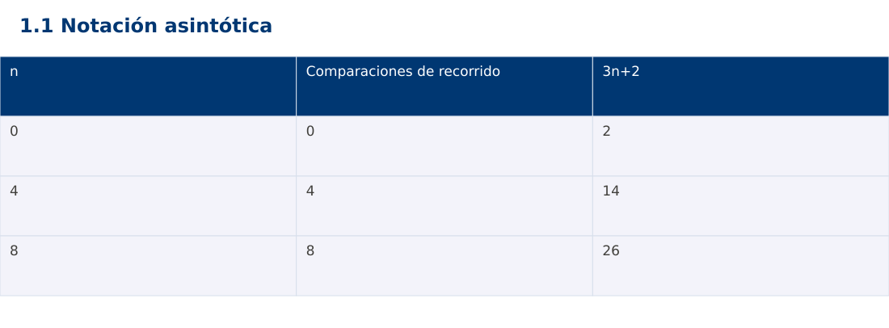

# Estructura de Datos
## 1.1 Notación asintótica · Python

**Ing. Pablo Torres, Mgtr.** · Universidad Politécnica Salesiana · Computación · Cuenca  
Unidad 1: Teoría de la Complejidad

[Índice del curso](../../../index.html) · [Presentación Java](../presentacion.pptx) · [Evaluación Moodle](../evaluaciones/tema.xml)

<a id="conceptos"></a>
## 1. Conceptos y ejemplos

**Prerrequisitos:** variables, condiciones, bucles, funciones y arreglos. El contenido desarrolla los conceptos adicionales que utiliza.

<a id="concepto-1"></a>
### 1.1 Modelo de costo y tamaño de entrada

La complejidad expresa cómo crece el trabajo al aumentar la entrada. Antes de contar, define n y una operación básica. Para buscar un código en un arreglo, n es el número de códigos y una comparación de claves es la operación. El tiempo del reloj también depende de la máquina, la carga y el entorno. Un conteo de operaciones permite comparar el crecimiento sin confundirlo con esas condiciones. Se asume acceso por índice y aritmética de enteros de tamaño fijo de costo constante.

<a id="concepto-2"></a>
### 1.2 Cotas O, Ω y Θ

T(n) pertenece a O(g(n)) si existen c > 0 y n₀ tales que T(n) ≤ c·g(n) para todo n ≥ n₀. Ω expresa una cota inferior y Θ ambas cotas simultáneamente. Para T(n)=3n+2, con n≥1 se cumple 3n ≤ T(n) ≤ 5n, por lo tanto T(n)∈Θ(n). También pertenece a O(n²), pero esa cota informa menos. O no significa por sí sola peor caso: se puede acotar una función de mejor caso, promedio o peor caso.

<a id="concepto-3"></a>
### 1.3 Conteo exacto y términos dominantes

Una búsqueda que visita todos los elementos realiza n comparaciones, incluso si el arreglo está vacío y n=0. Dos recorridos consecutivos cuestan n+n=2n, que pertenece a Θ(n). Un recorrido dentro de otro, ambos de n pasos independientes, cuesta n². Primero se obtiene el conteo que corresponde al código; después se simplifica. Eliminar constantes antes de identificar qué se cuenta puede ocultar errores.

<a id="concepto-4"></a>
### 1.4 Espacio auxiliar

Separa la memoria de la entrada de la memoria adicional. Un acumulador requiere Θ(1) espacio auxiliar. Copiar el arreglo requiere Θ(n). Las llamadas recursivas también ocupan memoria aunque el código no cree un arreglo explícito. El tamaño de un entero arbitrariamente grande no es constante: ese análisis queda fuera del modelo de palabra fija usado en los primeros ejemplos.

<a id="traza"></a>
### Traza de referencia

| n | Comparaciones de recorrido | 3n+2 |
| --- | --- | --- |
| 0 | 0 | 2 |
| 4 | 4 | 14 |
| 8 | 8 | 26 |

La tabla muestra estados o conteos concretos. Reproduce cada transición y comprueba qué propiedad permanece verdadera. Una traza finita ayuda a encontrar errores; la justificación del algoritmo también exige explicar por qué progresa y por qué la condición final satisface el contrato.



### Particularidades de Python

Python usa indentación para delimitar bloques y enteros de precisión arbitraria. // realiza división entera para índices no negativos. list.copy() crea una copia superficial; las listas y diccionarios mutables pueden compartirse mediante referencias. Las funciones de esta demostración reciben los tipos descritos en el contrato. Los assert son comprobaciones de desarrollo y deben ejecutarse sin la opción -O. No se requieren paquetes externos.

<a id="demostracion"></a>
## 2. Demostración guiada

**Problema y contrato:** Recibe una secuencia válida y cuenta elementos visitados sin modificarla. La entrada vacía produce cero. No mide segundos.

1. Lee el contrato y predice la salida del caso principal antes de ejecutar.
2. Identifica las variables que representan el estado y vincúlalas con la traza de la sección anterior.
3. Ejecuta el archivo completo. Las comprobaciones internas detienen el programa si una condición esperada falla.
4. Cambia una entrada del bloque de ejecución, predice el resultado y contrástalo. Conserva el núcleo de la demostración como referencia.

### Código completo

Este bloque se genera desde `ejemplos/demo.py` mediante `scripts/sync-code.py`; ese archivo es la fuente del código. La PC tiene otro objetivo y sus casos de aceptación aparecen en la sección 3.

<!-- DEMO:START -->
```python
def visits(values):
    count = 0
    for value in values:
        count += 1
    return count

if __name__ == "__main__":
    assert visits([]) == 0
    for n in (0, 4, 8):
        assert visits([0] * n) == n
        print(f"{n}:{visits([0] * n)}")
```
<!-- DEMO:END -->

### Ejecución

Desde esta carpeta `01-complexity-analysis/1.1-notation/python`:

```bash
python3 ejemplos/demo.py
```

### Salida esperada de la demostración

```text
0:0
4:4
8:8
```

La salida procede de los datos fijos del bloque de ejecución. Las verificaciones internas también cubren los casos adicionales que se leen en el código. El registro de ejecuciones realizadas se conserva en [verificación](../../../docs/verificacion.md), separado de estas expectativas.

<a id="pc"></a>
## 3. PC — 1.1: Notación asintótica

Implementa un contador de comparaciones para encontrar el primer índice de un valor. Devuelve -1 si no existe. Separa el contador del resultado y justifica mejor y peor caso sin usar tiempos como prueba de una cota.

### Requisitos de la entrega

- Implementa la actividad en **una versión**, a tu elección entre Java, Python y JavaScript. Las PL se entregan exclusivamente en Java.
- Separa la lógica del procesamiento de la entrada y la impresión. Documenta tipos, dominio válido, salida y comportamiento de error.
- Conserva los casos de aceptación siguientes y agrega al menos un caso que compruebe el invariante del tema.
- No copies como solución el bloque de demostración: resuelve la ampliación pedida. No se suministra una solución completa de esta PC.

### Casos de aceptación de la PC

| Entrada o escenario | Resultado exigido |
| --- | --- |
| [4,8,2], objetivo 4 | índice 0; 1 comparación |
| [4,8,2], objetivo 9 | -1; 3 comparaciones |
| [], objetivo 4 | -1; 0 comparaciones |

### Ejecución y evidencia

Desde la carpeta de tu entrega, ejecuta el programa con `python3 main.py`. Si divides Java en paquetes, utiliza los comandos de la plantilla del estudiante. Registra entrada, resultado esperado, resultado real y explicación de cualquier diferencia en `evidencias/PC1.1.md` de tu repositorio personal.

Crea commits pequeños: `feat(pc1.1): implementar contrato`, `test(pc1.1): cubrir casos limite` y `docs(pc1.1): explicar costos`. Sustituye los mensajes por descripciones del cambio real. Obtén el hash con `git rev-parse HEAD` y revisa una etapa con `git show HASH`. La actividad no necesita continuar un proyecto acumulativo.


<a id="esencial"></a>
## Lo esencial

- La complejidad expresa cómo crece el trabajo al aumentar la entrada.
- Separa la memoria de la entrada de la memoria adicional.
- Explica el contrato, traza una entrada y justifica tiempo y memoria con las condiciones descritas.

## Referencias

- Programa analítico y referencias del docente: correspondencia en el documento docente de este contenido.
- [Referencia técnica de Python](https://docs.python.org/3.14/).
- [Bibliografía y análisis de fuentes](../../../docs/analisis-referencias.md).
