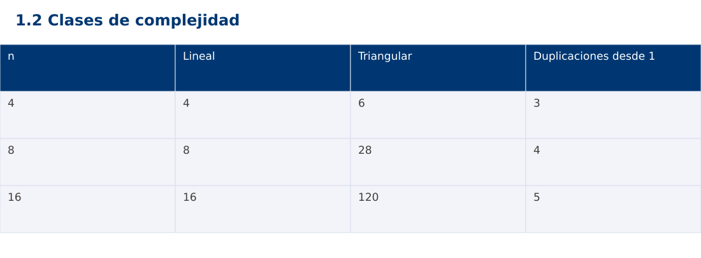

# Estructura de Datos
## 1.2 Clases de complejidad · JavaScript

**Ing. Pablo Torres, Mgtr.** · Universidad Politécnica Salesiana · Computación · Cuenca  
Unidad 1: Teoría de la Complejidad

[Índice del curso](../../../index.html) · [Presentación Java](../presentacion.pptx) · [Evaluación Moodle](../evaluaciones/tema.xml)

<a id="conceptos"></a>
## 1. Conceptos y ejemplos

**Prerrequisitos:** variables, condiciones, bucles, funciones y arreglos. El contenido desarrolla los conceptos adicionales que utiliza.

<a id="concepto-1"></a>
### 1.1 Crecimientos habituales

Los órdenes Θ(1), Θ(log n), Θ(n), Θ(n log n), Θ(n²) y Θ(2ⁿ) describen familias de crecimiento. Acceder a una posición conocida de un arreglo es constante en el modelo adoptado. Reducir repetidamente a la mitad un intervalo produce crecimiento logarítmico. Recorrer todas las posiciones produce crecimiento lineal. La clase describe el comportamiento asintótico, no garantiza que una implementación gane para cualquier tamaño pequeño.

<a id="concepto-2"></a>
### 1.2 Duplicar la entrada

Al duplicar n, un trabajo lineal se multiplica aproximadamente por dos y uno cuadrático por cuatro. Para log₂(n), duplicar n añade una unidad. En un algoritmo exponencial, pasar de n a n+1 puede duplicar el trabajo. Por eso un ejemplo exponencial debe ejecutarse con límites pequeños. No ejecutes entradas desmesuradas para confirmar una tendencia que ya se deduce del conteo.

<a id="concepto-3"></a>
### 1.3 Bucles dependientes

En un triángulo de comparaciones, la iteración i visita n-i-1 posiciones. La suma es (n-1)+(n-2)+…+1=n(n-1)/2. El costo es Θ(n²), aunque el número de repeticiones internas disminuya. En un ciclo que duplica k hasta superar n, el número de pasos es ⌊log₂ n⌋+1 para n≥1. Si el bucle externo ejecuta n veces ese ciclo, el costo es Θ(n log n).

<a id="concepto-4"></a>
### 1.4 Peor caso, promedio y amortizado

El promedio exige un modelo de distribución de entradas. El análisis amortizado distribuye el costo de una secuencia de operaciones y no presupone entradas aleatorias. Un arreglo dinámico puede realojar n elementos en una expansión, pero muchas inserciones al final tienen costo amortizado constante. No atribuyas ese resultado a cada llamada individual ni a cualquier operación de una colección.

<a id="traza"></a>
### Traza de referencia

| n | Lineal | Triangular | Duplicaciones desde 1 |
| --- | --- | --- | --- |
| 4 | 4 | 6 | 3 |
| 8 | 8 | 28 | 4 |
| 16 | 16 | 120 | 5 |

La tabla muestra estados o conteos concretos. Reproduce cada transición y comprueba qué propiedad permanece verdadera. Una traza finita ayuda a encontrar errores; la justificación del algoritmo también exige explicar por qué progresa y por qué la condición final satisface el contrato.



### Particularidades de JavaScript

JavaScript se ejecuta aquí con Node.js como módulo .mjs. Number solo representa exactamente enteros hasta 2^53-1; factorial usa BigInt y no mezcla su aritmética con Number. Math.floor realiza la división para índices. [...a] es una copia superficial. Map y Set expresan asociaciones y pertenencia. Los errores se verifican con condiciones explícitas, ya que console.assert no sustituye una prueba que detenga el proceso. No se requiere pnpm.

<a id="demostracion"></a>
## 2. Demostración guiada

**Problema y contrato:** n entero no negativo. Cuenta pares de índices i<j. El ejemplo usa tamaños pequeños; no pretende ejecutar entradas gigantes ni medir su tiempo.

1. Lee el contrato y predice la salida del caso principal antes de ejecutar.
2. Identifica las variables que representan el estado y vincúlalas con la traza de la sección anterior.
3. Ejecuta el archivo completo. Las comprobaciones internas detienen el programa si una condición esperada falla.
4. Cambia una entrada del bloque de ejecución, predice el resultado y contrástalo. Conserva el núcleo de la demostración como referencia.

### Código completo

Este bloque se genera desde `ejemplos/demo.mjs` mediante `scripts/sync-code.py`; ese archivo es la fuente del código. La PC tiene otro objetivo y sus casos de aceptación aparecen en la sección 3.

<!-- DEMO:START -->
```javascript
function pairs(n) {
    if (!Number.isSafeInteger(n) || n < 0) throw new RangeError("n inválido");
    let count = 0;
    for (let i = 0; i < n; i++)
        for (let j = i + 1; j < n; j++) count++;
    return count;
}
if (pairs(0) !== 0) throw new Error("Vacío");
for (const n of [4, 8, 16]) {
    if (pairs(n) !== n * (n - 1) / 2) throw new Error("Conteo");
    console.log(`${n}:${pairs(n)}`);
}
let rejected = false;
try { pairs(-1); } catch (e) { rejected = e instanceof RangeError; }
if (!rejected) throw new Error("Debió rechazar n");
```
<!-- DEMO:END -->

### Ejecución

Desde esta carpeta `01-complexity-analysis/1.2-growth/js`:

```bash
node ejemplos/demo.mjs
```

### Salida esperada de la demostración

```text
4:6
8:28
16:120
```

La salida procede de los datos fijos del bloque de ejecución. Las verificaciones internas también cubren los casos adicionales que se leen en el código. El registro de ejecuciones realizadas se conserva en [verificación](../../../docs/verificacion.md), separado de estas expectativas.

<a id="pc"></a>
## 3. PC — 1.2: Clases de complejidad

Construye una tabla para n=4,8,16,32 que cuente operaciones de tres bucles: triangular, reducción por mitades y n repeticiones de reducción por mitades. Entrega las fórmulas y una interpretación de las razones de crecimiento.

### Requisitos de la entrega

- Implementa la actividad en **una versión**, a tu elección entre Java, Python y JavaScript. Las PL se entregan exclusivamente en Java.
- Separa la lógica del procesamiento de la entrada y la impresión. Documenta tipos, dominio válido, salida y comportamiento de error.
- Conserva los casos de aceptación siguientes y agrega al menos un caso que compruebe el invariante del tema.
- No copies como solución el bloque de demostración: resuelve la ampliación pedida. No se suministra una solución completa de esta PC.

### Casos de aceptación de la PC

| Entrada o escenario | Resultado exigido |
| --- | --- |
| n=4, triangular | 6 operaciones |
| n=8, triangular | 28 operaciones |
| n=0 | 0 operaciones en los tres conteos |

### Ejecución y evidencia

Desde la carpeta de tu entrega, ejecuta el programa con `node main.mjs`. Si divides Java en paquetes, utiliza los comandos de la plantilla del estudiante. Registra entrada, resultado esperado, resultado real y explicación de cualquier diferencia en `evidencias/PC1.2.md` de tu repositorio personal.

Crea commits pequeños: `feat(pc1.2): implementar contrato`, `test(pc1.2): cubrir casos limite` y `docs(pc1.2): explicar costos`. Sustituye los mensajes por descripciones del cambio real. Obtén el hash con `git rev-parse HEAD` y revisa una etapa con `git show HASH`. La actividad no necesita continuar un proyecto acumulativo.


<a id="esencial"></a>
## Lo esencial

- Los órdenes Θ(1), Θ(log n), Θ(n), Θ(n log n), Θ(n²) y Θ(2ⁿ) describen familias de crecimiento.
- El promedio exige un modelo de distribución de entradas.
- Explica el contrato, traza una entrada y justifica tiempo y memoria con las condiciones descritas.

## Referencias

- Programa analítico y referencias del docente: correspondencia en el documento docente de este contenido.
- [Referencia técnica de JavaScript](https://developer.mozilla.org/en-US/docs/Web/JavaScript/Reference).
- [Bibliografía y análisis de fuentes](../../../docs/analisis-referencias.md).
