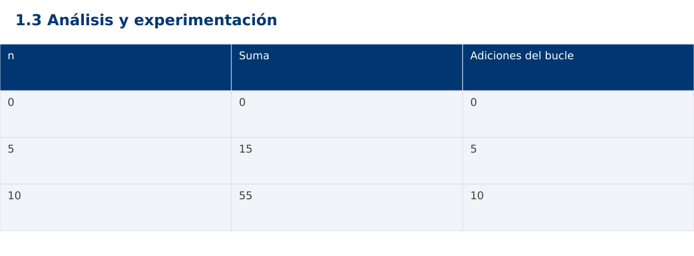

# Estructura de Datos
## 1.3 Análisis y experimentación · JavaScript

**Ing. Pablo Torres, Mgtr.** · Universidad Politécnica Salesiana · Computación · Cuenca  
Unidad 1: Teoría de la Complejidad

[Índice del curso](../../../index.html) · [Presentación Java](../presentacion.pptx) · [Evaluación Moodle](../evaluaciones/tema.xml)

<a id="conceptos"></a>
## 1. Conceptos y ejemplos

**Prerrequisitos:** variables, condiciones, bucles, funciones y arreglos. El contenido desarrolla los conceptos adicionales que utiliza.

<a id="concepto-1"></a>
### 1.1 Contrato, corrección y costo

Antes de medir, establece entradas válidas, salida, cambios permitidos y errores. Un algoritmo rápido que produce una salida incorrecta no resuelve el problema. Un invariante es una propiedad que se conserva entre iteraciones: al terminar la iteración i de una suma, el acumulador contiene la suma del prefijo procesado. La demostración usa inicialización, conservación y terminación.

<a id="concepto-2"></a>
### 1.2 Conteo de algoritmos equivalentes

Para sumar 1…n, un bucle realiza n adiciones. La fórmula n(n+1)/2 usa un número constante de operaciones bajo aritmética de palabra fija. Las dos estrategias deben producir lo mismo para n=0,1,10 y otros valores. La fórmula puede desbordar durante el producto aunque el resultado final cupiera. El ejemplo limita n para que las tres versiones compartan un dominio seguro y comprueba antes de calcular.

<a id="concepto-3"></a>
### 1.3 Diseño de una medición

Genera los datos antes de iniciar el cronómetro, usa copias independientes si el algoritmo modifica la entrada y ejecuta calentamiento. Repite varias veces y registra mediana junto con tamaño, semilla, versión y equipo. La impresión y la generación de datos fuera del intervalo evitan medir tareas ajenas. No compares Java, Python y JavaScript como si tuvieran iguales costos constantes.

<a id="concepto-4"></a>
### 1.4 Interpretación de resultados

Los conteos explican tendencias y las mediciones describen un entorno concreto. Una prueba con tres tamaños no demuestra una cota asintótica. Un valor cero en un cronómetro de baja resolución no significa costo nulo. Si una muestra tarda demasiado, registra el límite y la interrupción en lugar de inventar un resultado. Reporta también el espacio adicional y las restricciones del contrato.

<a id="traza"></a>
### Traza de referencia

| n | Suma | Adiciones del bucle |
| --- | --- | --- |
| 0 | 0 | 0 |
| 5 | 15 | 5 |
| 10 | 55 | 10 |

La tabla muestra estados o conteos concretos. Reproduce cada transición y comprueba qué propiedad permanece verdadera. Una traza finita ayuda a encontrar errores; la justificación del algoritmo también exige explicar por qué progresa y por qué la condición final satisface el contrato.



### Particularidades de JavaScript

JavaScript se ejecuta aquí con Node.js como módulo .mjs. Number solo representa exactamente enteros hasta 2^53-1; factorial usa BigInt y no mezcla su aritmética con Number. Math.floor realiza la división para índices. [...a] es una copia superficial. Map y Set expresan asociaciones y pertenencia. Los errores se verifican con condiciones explícitas, ya que console.assert no sustituye una prueba que detenga el proceso. No se requiere pnpm.

<a id="demostracion"></a>
## 2. Demostración guiada

**Problema y contrato:** n entero en [0,1000000]. Devuelve la suma 1…n. Java usa long antes de multiplicar; JavaScript permanece dentro del rango entero exacto de Number.

1. Lee el contrato y predice la salida del caso principal antes de ejecutar.
2. Identifica las variables que representan el estado y vincúlalas con la traza de la sección anterior.
3. Ejecuta el archivo completo. Las comprobaciones internas detienen el programa si una condición esperada falla.
4. Cambia una entrada del bloque de ejecución, predice el resultado y contrástalo. Conserva el núcleo de la demostración como referencia.

### Código completo

Este bloque se genera desde `ejemplos/demo.mjs` mediante `scripts/sync-code.py`; ese archivo es la fuente del código. La PC tiene otro objetivo y sus casos de aceptación aparecen en la sección 3.

<!-- DEMO:START -->
```javascript
function validate(n) {
    if (!Number.isSafeInteger(n) || n < 0 || n > 1000000)
        throw new RangeError("fuera de rango");
}
function sumLoop(n) {
    validate(n);
    let total = 0;
    for (let i = 1; i <= n; i++) total += i;
    return total;
}
function sumFormula(n) { validate(n); return n * (n + 1) / 2; }
for (const n of [0, 5, 10, 1000]) {
    if (sumLoop(n) !== sumFormula(n)) throw new Error("Resultado");
    console.log(`${n}:${sumLoop(n)}`);
}
let rejected = false;
try { sumLoop(-1); } catch (e) { rejected = e instanceof RangeError; }
if (!rejected) throw new Error("Dominio");
```
<!-- DEMO:END -->

### Ejecución

Desde esta carpeta `01-complexity-analysis/1.3-analysis/js`:

```bash
node ejemplos/demo.mjs
```

### Salida esperada de la demostración

```text
0:0
5:15
10:55
1000:500500
```

La salida procede de los datos fijos del bloque de ejecución. Las verificaciones internas también cubren los casos adicionales que se leen en el código. El registro de ejecuciones realizadas se conserva en [verificación](../../../docs/verificacion.md), separado de estas expectativas.

<a id="pc"></a>
## 3. PC — 1.3: Análisis y experimentación

Compara dos algoritmos propios para detectar duplicados: pares i<j y ordenación de una copia seguida de recorrido. Verifica corrección antes de medir. Usa entradas con y sin repetidos y registra conteos separados de tiempos.

### Requisitos de la entrega

- Implementa la actividad en **una versión**, a tu elección entre Java, Python y JavaScript. Las PL se entregan exclusivamente en Java.
- Separa la lógica del procesamiento de la entrada y la impresión. Documenta tipos, dominio válido, salida y comportamiento de error.
- Conserva los casos de aceptación siguientes y agrega al menos un caso que compruebe el invariante del tema.
- No copies como solución el bloque de demostración: resuelve la ampliación pedida. No se suministra una solución completa de esta PC.

### Casos de aceptación de la PC

| Entrada o escenario | Resultado exigido |
| --- | --- |
| [3,1,3] | hay duplicados |
| [1,2,3] | no hay duplicados |
| [] y [1] | no hay duplicados; sin accesos inválidos |

### Ejecución y evidencia

Desde la carpeta de tu entrega, ejecuta el programa con `node main.mjs`. Si divides Java en paquetes, utiliza los comandos de la plantilla del estudiante. Registra entrada, resultado esperado, resultado real y explicación de cualquier diferencia en `evidencias/PC1.3.md` de tu repositorio personal.

Crea commits pequeños: `feat(pc1.3): implementar contrato`, `test(pc1.3): cubrir casos limite` y `docs(pc1.3): explicar costos`. Sustituye los mensajes por descripciones del cambio real. Obtén el hash con `git rev-parse HEAD` y revisa una etapa con `git show HASH`. La actividad no necesita continuar un proyecto acumulativo.


<a id="esencial"></a>
## Lo esencial

- Antes de medir, establece entradas válidas, salida, cambios permitidos y errores.
- Los conteos explican tendencias y las mediciones describen un entorno concreto.
- Explica el contrato, traza una entrada y justifica tiempo y memoria con las condiciones descritas.

## Referencias

- Programa analítico y referencias del docente: correspondencia en el documento docente de este contenido.
- [Referencia técnica de JavaScript](https://developer.mozilla.org/en-US/docs/Web/JavaScript/Reference).
- [Bibliografía y análisis de fuentes](../../../docs/analisis-referencias.md).
