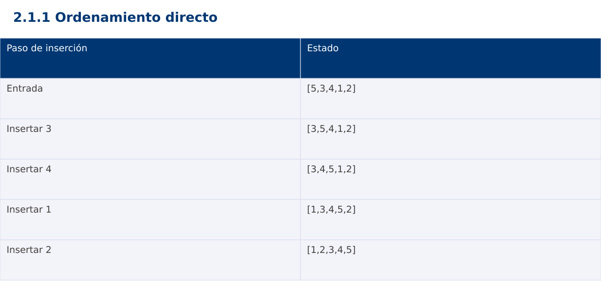

# Estructura de Datos
## 2.1.1 Ordenamiento directo · JavaScript

**Ing. Pablo Torres, Mgtr.** · Universidad Politécnica Salesiana · Computación · Cuenca  
Unidad 2: Ordenamiento, búsqueda y recursividad

[Índice del curso](../../../index.html) · [Presentación Java](../presentacion.pptx) · [Evaluación Moodle](../evaluaciones/tema.xml)

<a id="conceptos"></a>
## 1. Conceptos y ejemplos

**Prerrequisitos:** variables, condiciones, bucles, funciones y arreglos. El contenido desarrolla los conceptos adicionales que utiliza.

<a id="concepto-1"></a>
### 1.1 Claves, orden y estabilidad

Ordenar consiste en reorganizar registros según una clave y un criterio consistente. La salida debe conservar todos los elementos y quedar en orden no decreciente. Un método estable preserva el orden relativo de registros con claves iguales. Para comprobar estabilidad hacen falta etiquetas: (2,A),(1,B),(2,C) debe conservar A antes de C. Comparar únicamente números repetidos no revela si se intercambiaron sus identidades.

<a id="concepto-2"></a>
### 1.2 Burbuja con detección de cambios

Cada pasada compara vecinos y desplaza el mayor del tramo activo hacia su extremo derecho. Después de una pasada, esa última posición queda fijada. El tramo se reduce y una bandera permite terminar si no hubo intercambios. Con comparación estricta > conserva estabilidad. Su mejor caso es Θ(n) con la bandera; el peor es Θ(n²). El algoritmo que compara a[i] con todos los a[j] posteriores es intercambio directo, no esta variante de burbuja adyacente.

<a id="concepto-3"></a>
### 1.3 Selección del mínimo

En cada posición i se busca el mínimo del sufijo y se hace como máximo un intercambio. El prefijo contiene los i menores elementos en orden. Realiza n(n-1)/2 comparaciones independientemente del orden inicial. Reduce intercambios, pero la variante usual no es estable: [2A,2B,1] puede terminar [1,2B,2A]. No debe confundirse encontrar el mínimo con ir intercambiando cada candidato menor.

<a id="concepto-4"></a>
### 1.4 Inserción y desplazamiento

Se guarda una clave y se desplazan a la derecha los valores mayores del prefijo ordenado. Cuando aparece un valor menor o igual, se inserta la clave. Usar > en el desplazamiento conserva la estabilidad. En datos ordenados cuesta Θ(n) y en orden inverso Θ(n²). Consume Θ(1) memoria auxiliar y se adapta a pocas inversiones. La condición j≥0 debe comprobarse antes de acceder a a[j].

<a id="concepto-5"></a>
### 1.5 Elección del método

Los tres métodos son útiles para entender invariantes y costos. Para datos pequeños casi ordenados, inserción aprovecha el orden existente. Selección conviene como contraste cuando interesan pocas escrituras, sin prometer superioridad general. Burbuja facilita trazados de vecinos. La demostración ordena copias del mismo arreglo y comprueba que las tres salidas coincidan.

<a id="traza"></a>
### Traza de referencia

| Paso de inserción | Estado |
| --- | --- |
| Entrada | [5,3,4,1,2] |
| Insertar 3 | [3,5,4,1,2] |
| Insertar 4 | [3,4,5,1,2] |
| Insertar 1 | [1,3,4,5,2] |
| Insertar 2 | [1,2,3,4,5] |

La tabla muestra estados o conteos concretos. Reproduce cada transición y comprueba qué propiedad permanece verdadera. Una traza finita ayuda a encontrar errores; la justificación del algoritmo también exige explicar por qué progresa y por qué la condición final satisface el contrato.



### Particularidades de JavaScript

JavaScript se ejecuta aquí con Node.js como módulo .mjs. Number solo representa exactamente enteros hasta 2^53-1; factorial usa BigInt y no mezcla su aritmética con Number. Math.floor realiza la división para índices. [...a] es una copia superficial. Map y Set expresan asociaciones y pertenencia. Los errores se verifican con condiciones explícitas, ya que console.assert no sustituye una prueba que detenga el proceso. No se requiere pnpm.

<a id="demostracion"></a>
## 2. Demostración guiada

**Problema y contrato:** Arreglo de enteros válidos. Modifica la entrada en orden ascendente y conserva repeticiones. Acepta vacío y un elemento. La biblioteca de ordenación se usa únicamente como oráculo de verificación, no dentro del algoritmo.

1. Lee el contrato y predice la salida del caso principal antes de ejecutar.
2. Identifica las variables que representan el estado y vincúlalas con la traza de la sección anterior.
3. Ejecuta el archivo completo. Las comprobaciones internas detienen el programa si una condición esperada falla.
4. Cambia una entrada del bloque de ejecución, predice el resultado y contrástalo. Conserva el núcleo de la demostración como referencia.

### Código completo

Este bloque se genera desde `ejemplos/demo.mjs` mediante `scripts/sync-code.py`; ese archivo es la fuente del código. La PC tiene otro objetivo y sus casos de aceptación aparecen en la sección 3.

<!-- DEMO:START -->
```javascript
function bubble(a) {
    for (let end = a.length - 1; end > 0; end--) {
        let changed = false;
        for (let j = 0; j < end; j++) {
            if (a[j] > a[j+1]) {
                [a[j], a[j+1]] = [a[j+1], a[j]]; changed = true;
            }
        }
        if (!changed) break;
    }
}
function selection(a) {
    for (let i = 0; i < a.length - 1; i++) {
        let min = i;
        for (let j = i+1; j < a.length; j++) if (a[j] < a[min]) min = j;
        [a[i],a[min]] = [a[min],a[i]];
    }
}
function insertion(a) {
    for (let i = 1; i < a.length; i++) {
        const key = a[i]; let j = i-1;
        while (j >= 0 && a[j] > key) { a[j+1] = a[j]; j--; }
        a[j+1] = key;
    }
}
function sort(a) {
    const b = [...a], c = [...a]; bubble(b); selection(c); insertion(a);
    if (JSON.stringify(a) !== JSON.stringify(b) || JSON.stringify(a) !== JSON.stringify(c))
        throw new Error("Métodos diferentes");
}

for (const data of [[5,3,4,1,2], [], [1], [2,2,1], [-1,5,0], [1,2,3], [3,2,1]]) {
    const a = [...data]; sort(a);
    const expected = [...data].sort((x,y) => x-y);
    if (JSON.stringify(a) !== JSON.stringify(expected)) throw new Error("Orden incorrecto");
}
const a = [5,3,4,1,2]; sort(a);
console.log(`[${a.join(", ")}]`);
```
<!-- DEMO:END -->

### Ejecución

Desde esta carpeta `02-searching-and-sorting-algorithms/2.1.1-direct-sorts/js`:

```bash
node ejemplos/demo.mjs
```

### Salida esperada de la demostración

```text
[1, 2, 3, 4, 5]
```

La salida procede de los datos fijos del bloque de ejecución. Las verificaciones internas también cubren los casos adicionales que se leen en el código. El registro de ejecuciones realizadas se conserva en [verificación](../../../docs/verificacion.md), separado de estas expectativas.

<a id="pc"></a>
## 3. PC — 2.1.1: Ordenamiento directo

Ordena registros con código, nota y posición original mediante inserción estable. Conserva el orden de llegada cuando las notas coincidan. Implementa contadores de comparaciones y desplazamientos, sin usar la ordenación de biblioteca.

### Requisitos de la entrega

- Implementa la actividad en **una versión**, a tu elección entre Java, Python y JavaScript. Las PL se entregan exclusivamente en Java.
- Separa la lógica del procesamiento de la entrada y la impresión. Documenta tipos, dominio válido, salida y comportamiento de error.
- Conserva los casos de aceptación siguientes y agrega al menos un caso que compruebe el invariante del tema.
- No copies como solución el bloque de demostración: resuelve la ampliación pedida. No se suministra una solución completa de esta PC.

### Casos de aceptación de la PC

| Entrada o escenario | Resultado exigido |
| --- | --- |
| [(A,8),(B,5),(C,8)] | B,A,C; A precede a C |
| [] | [] |
| [(A,8),(B,8)] | A,B sin invertir empates |

### Ejecución y evidencia

Desde la carpeta de tu entrega, ejecuta el programa con `node main.mjs`. Si divides Java en paquetes, utiliza los comandos de la plantilla del estudiante. Registra entrada, resultado esperado, resultado real y explicación de cualquier diferencia en `evidencias/PC2.1.1.md` de tu repositorio personal.

Crea commits pequeños: `feat(pc2.1.1): implementar contrato`, `test(pc2.1.1): cubrir casos limite` y `docs(pc2.1.1): explicar costos`. Sustituye los mensajes por descripciones del cambio real. Obtén el hash con `git rev-parse HEAD` y revisa una etapa con `git show HASH`. La actividad no necesita continuar un proyecto acumulativo.


<a id="esencial"></a>
## Lo esencial

- Ordenar consiste en reorganizar registros según una clave y un criterio consistente.
- Los tres métodos son útiles para entender invariantes y costos.
- Explica el contrato, traza una entrada y justifica tiempo y memoria con las condiciones descritas.

## Referencias

- Programa analítico y referencias del docente: correspondencia en el documento docente de este contenido.
- [Referencia técnica de JavaScript](https://developer.mozilla.org/en-US/docs/Web/JavaScript/Reference).
- [Bibliografía y análisis de fuentes](../../../docs/analisis-referencias.md).
