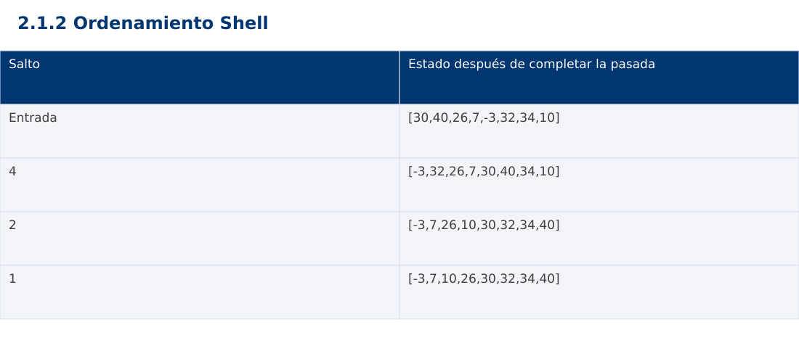

# Estructura de Datos
## 2.1.2 Ordenamiento Shell · JavaScript

**Ing. Pablo Torres, Mgtr.** · Universidad Politécnica Salesiana · Computación · Cuenca  
Unidad 2: Ordenamiento, búsqueda y recursividad

[Índice del curso](../../../index.html) · [Presentación Java](../presentacion.pptx) · [Evaluación Moodle](../evaluaciones/tema.xml)

<a id="conceptos"></a>
## 1. Conceptos y ejemplos

**Prerrequisitos:** variables, condiciones, bucles, funciones y arreglos. El contenido desarrolla los conceptos adicionales que utiliza.

<a id="concepto-1"></a>
### 1.1 Inserción con saltos

Shell ordena subsecuencias cuyos índices difieren en un salto h. Con h=4, los índices 0,4,8 pertenecen a una subsecuencia y 1,5,9 a otra. Se aplica inserción dentro de cada grupo sin construir nuevos arreglos. Los saltos permiten corregir inversiones distantes antes de la pasada final. Un arreglo h-ordenado no necesariamente está ordenado entre posiciones vecinas.

<a id="concepto-2"></a>
### 1.2 Secuencia y terminación

La variante del curso usa h=⌊n/2⌋ y divide h entre dos hasta llegar a cero. Es indispensable ejecutar h=1 para garantizar el orden total. Para n=8 se usan 4,2,1. Para n≤1 no hacen falta pasadas. El número de saltos es logarítmico, pero el costo de cada inserción depende de cuántos desplazamientos realiza: no basta contar los valores de h para deducir todo el tiempo.

<a id="concepto-3"></a>
### 1.3 Costo y estabilidad

La complejidad depende de la secuencia de incrementos. Para la secuencia por mitades implementada aquí, el peor caso es Θ(n²). No se atribuye una cota universal n log n a todas las variantes. La memoria auxiliar es Θ(1). Shell es normalmente inestable porque movimientos distantes pueden invertir registros con claves iguales sin compararlos directamente.

<a id="concepto-4"></a>
### 1.4 Traza y límites de índices

Antes de desplazar a[j-h], verifica j≥h. Guarda el valor a insertar antes de empezar para no perderlo. Al terminar cada salto, comprueba a[i-h]≤a[i] para todo índice válido. Esa propiedad local ayuda a depurar. La última pasada con h=1 transforma la propiedad local en orden no decreciente completo.

<a id="traza"></a>
### Traza de referencia

| Salto | Estado después de completar la pasada |
| --- | --- |
| Entrada | [30,40,26,7,-3,32,34,10] |
| 4 | [-3,32,26,7,30,40,34,10] |
| 2 | [-3,7,26,10,30,32,34,40] |
| 1 | [-3,7,10,26,30,32,34,40] |

La tabla muestra estados o conteos concretos. Reproduce cada transición y comprueba qué propiedad permanece verdadera. Una traza finita ayuda a encontrar errores; la justificación del algoritmo también exige explicar por qué progresa y por qué la condición final satisface el contrato.



### Particularidades de JavaScript

JavaScript se ejecuta aquí con Node.js como módulo .mjs. Number solo representa exactamente enteros hasta 2^53-1; factorial usa BigInt y no mezcla su aritmética con Number. Math.floor realiza la división para índices. [...a] es una copia superficial. Map y Set expresan asociaciones y pertenencia. Los errores se verifican con condiciones explícitas, ya que console.assert no sustituye una prueba que detenga el proceso. No se requiere pnpm.

<a id="demostracion"></a>
## 2. Demostración guiada

**Problema y contrato:** Arreglo de enteros válidos. Modifica la entrada en orden ascendente y conserva repeticiones. Acepta vacío y un elemento. La biblioteca de ordenación se usa únicamente como oráculo de verificación, no dentro del algoritmo.

1. Lee el contrato y predice la salida del caso principal antes de ejecutar.
2. Identifica las variables que representan el estado y vincúlalas con la traza de la sección anterior.
3. Ejecuta el archivo completo. Las comprobaciones internas detienen el programa si una condición esperada falla.
4. Cambia una entrada del bloque de ejecución, predice el resultado y contrástalo. Conserva el núcleo de la demostración como referencia.

### Código completo

Este bloque se genera desde `ejemplos/demo.mjs` mediante `scripts/sync-code.py`; ese archivo es la fuente del código. La PC tiene otro objetivo y sus casos de aceptación aparecen en la sección 3.

<!-- DEMO:START -->
```javascript
function sort(a) {
    for (let h = Math.floor(a.length/2); h > 0; h = Math.floor(h/2)) {
        for (let i = h; i < a.length; i++) {
            const key = a[i]; let j = i;
            while (j >= h && a[j-h] > key) { a[j] = a[j-h]; j -= h; }
            a[j] = key;
        }
    }
}

for (const data of [[5,3,4,1,2], [], [1], [2,2,1], [-1,5,0], [1,2,3], [3,2,1]]) {
    const a = [...data]; sort(a);
    const expected = [...data].sort((x,y) => x-y);
    if (JSON.stringify(a) !== JSON.stringify(expected)) throw new Error("Orden incorrecto");
}
const a = [5,3,4,1,2]; sort(a);
console.log(`[${a.join(", ")}]`);
```
<!-- DEMO:END -->

### Ejecución

Desde esta carpeta `02-searching-and-sorting-algorithms/2.1.2-shell-sort/js`:

```bash
node ejemplos/demo.mjs
```

### Salida esperada de la demostración

```text
[1, 2, 3, 4, 5]
```

La salida procede de los datos fijos del bloque de ejecución. Las verificaciones internas también cubren los casos adicionales que se leen en el código. El registro de ejecuciones realizadas se conserva en [verificación](../../../docs/verificacion.md), separado de estas expectativas.

<a id="pc"></a>
## 3. PC — 2.1.2: Ordenamiento Shell

Implementa Shell con dos secuencias: mitades y Knuth 1,4,13,… utilizada en orden descendente. Registra desplazamientos por salto, verifica el invariante h-ordenado y compara entradas idénticas.

### Requisitos de la entrega

- Implementa la actividad en **una versión**, a tu elección entre Java, Python y JavaScript. Las PL se entregan exclusivamente en Java.
- Separa la lógica del procesamiento de la entrada y la impresión. Documenta tipos, dominio válido, salida y comportamiento de error.
- Conserva los casos de aceptación siguientes y agrega al menos un caso que compruebe el invariante del tema.
- No copies como solución el bloque de demostración: resuelve la ampliación pedida. No se suministra una solución completa de esta PC.

### Casos de aceptación de la PC

| Entrada o escenario | Resultado exigido |
| --- | --- |
| [9,1,8,2] | [1,2,8,9] |
| [2,2,1] | [1,2,2] |
| [] | sin pasadas ni errores |

### Ejecución y evidencia

Desde la carpeta de tu entrega, ejecuta el programa con `node main.mjs`. Si divides Java en paquetes, utiliza los comandos de la plantilla del estudiante. Registra entrada, resultado esperado, resultado real y explicación de cualquier diferencia en `evidencias/PC2.1.2.md` de tu repositorio personal.

Crea commits pequeños: `feat(pc2.1.2): implementar contrato`, `test(pc2.1.2): cubrir casos limite` y `docs(pc2.1.2): explicar costos`. Sustituye los mensajes por descripciones del cambio real. Obtén el hash con `git rev-parse HEAD` y revisa una etapa con `git show HASH`. La actividad no necesita continuar un proyecto acumulativo.


<a id="esencial"></a>
## Lo esencial

- Shell ordena subsecuencias cuyos índices difieren en un salto h.
- Antes de desplazar a[j-h], verifica j≥h.
- Explica el contrato, traza una entrada y justifica tiempo y memoria con las condiciones descritas.

## Referencias

- Programa analítico y referencias del docente: correspondencia en el documento docente de este contenido.
- [Referencia técnica de JavaScript](https://developer.mozilla.org/en-US/docs/Web/JavaScript/Reference).
- [Bibliografía y análisis de fuentes](../../../docs/analisis-referencias.md).
