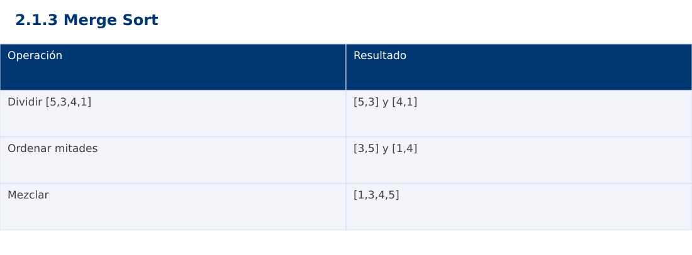

# Estructura de Datos
## 2.1.3 Merge Sort · Python

**Ing. Pablo Torres, Mgtr.** · Universidad Politécnica Salesiana · Computación · Cuenca  
Unidad 2: Ordenamiento, búsqueda y recursividad

[Índice del curso](../../../index.html) · [Presentación Java](../presentacion.pptx) · [Evaluación Moodle](../evaluaciones/tema.xml)

<a id="conceptos"></a>
## 1. Conceptos y ejemplos

**Prerrequisitos:** variables, condiciones, bucles, funciones y arreglos. El contenido desarrolla los conceptos adicionales que utiliza.

<a id="concepto-1"></a>
### 1.1 Dividir y combinar

Merge Sort divide un intervalo en dos mitades, ordena cada mitad y las combina. Trabajaremos con intervalos semiabiertos [lo,hi), cuyo tamaño es hi-lo. El caso base es tamaño ≤1. El punto medio lo+(hi-lo)/2 separa intervalos que cubren exactamente la entrada y no se solapan. Para seguir el ejemplo basta reconocer la llamada al mismo procedimiento sobre un intervalo menor; la Unidad 2.3 desarrolla formalmente la recursividad.

<a id="concepto-2"></a>
### 1.2 Mezcla de dos secuencias ordenadas

Dos índices señalan el siguiente elemento disponible de cada mitad. Se copia el menor al buffer y se avanza solo su índice. Al agotarse una mitad se copia el resto de la otra. El prefijo del buffer siempre contiene los menores elementos ya vistos en orden. En igualdad se elige la mitad izquierda para conservar estabilidad. Sin esa decisión, el algoritmo puede ordenar correctamente y aun así perder estabilidad.

<a id="concepto-3"></a>
### 1.3 Recurrencia y memoria

Cada nivel mezcla Θ(n) elementos y hay Θ(log n) niveles. La recurrencia T(n)=2T(n/2)+Θ(n) da Θ(n log n) en esta variante, incluso con datos ya ordenados. Un buffer compartido usa Θ(n) memoria auxiliar y la pila ocupa Θ(log n). Evitar copias de subarreglos en cada llamada facilita identificar esa memoria. El buffer se reserva una vez y se reutiliza.

<a id="concepto-4"></a>
### 1.4 Casos de borde

Los arreglos vacíos y unitarios terminan directamente. Los tamaños impares producen mitades que difieren en un elemento, lo que no afecta la corrección. Debe copiarse de regreso todo el intervalo mezclado, no el arreglo entero. Una confusión entre extremo inclusivo y exclusivo suele omitir el último elemento o repetirlo.

<a id="traza"></a>
### Traza de referencia

| Operación | Resultado |
| --- | --- |
| Dividir [5,3,4,1] | [5,3] y [4,1] |
| Ordenar mitades | [3,5] y [1,4] |
| Mezclar | [1,3,4,5] |

La tabla muestra estados o conteos concretos. Reproduce cada transición y comprueba qué propiedad permanece verdadera. Una traza finita ayuda a encontrar errores; la justificación del algoritmo también exige explicar por qué progresa y por qué la condición final satisface el contrato.



### Particularidades de Python

Python usa indentación para delimitar bloques y enteros de precisión arbitraria. // realiza división entera para índices no negativos. list.copy() crea una copia superficial; las listas y diccionarios mutables pueden compartirse mediante referencias. Las funciones de esta demostración reciben los tipos descritos en el contrato. Los assert son comprobaciones de desarrollo y deben ejecutarse sin la opción -O. No se requieren paquetes externos.

<a id="demostracion"></a>
## 2. Demostración guiada

**Problema y contrato:** Arreglo de enteros válidos. Modifica la entrada en orden ascendente y conserva repeticiones. Acepta vacío y un elemento. La biblioteca de ordenación se usa únicamente como oráculo de verificación, no dentro del algoritmo.

1. Lee el contrato y predice la salida del caso principal antes de ejecutar.
2. Identifica las variables que representan el estado y vincúlalas con la traza de la sección anterior.
3. Ejecuta el archivo completo. Las comprobaciones internas detienen el programa si una condición esperada falla.
4. Cambia una entrada del bloque de ejecución, predice el resultado y contrástalo. Conserva el núcleo de la demostración como referencia.

### Código completo

Este bloque se genera desde `ejemplos/demo.py` mediante `scripts/sync-code.py`; ese archivo es la fuente del código. La PC tiene otro objetivo y sus casos de aceptación aparecen en la sección 3.

<!-- DEMO:START -->
```python
def sort(a):
    buffer = [0] * len(a)
    def merge_sort(lo, hi):
        if hi - lo <= 1:
            return
        mid = lo + (hi - lo) // 2
        merge_sort(lo, mid)
        merge_sort(mid, hi)
        i, j, k = lo, mid, lo
        while i < mid and j < hi:
            if a[i] <= a[j]:
                buffer[k] = a[i]
                i += 1
            else:
                buffer[k] = a[j]
                j += 1
            k += 1
        while i < mid:
            buffer[k] = a[i]
            i += 1
            k += 1
        while j < hi:
            buffer[k] = a[j]
            j += 1
            k += 1
        for k in range(lo, hi):
            a[k] = buffer[k]
    merge_sort(0, len(a))

if __name__ == "__main__":
    for data in ([5,3,4,1,2], [], [1], [2,2,1], [-1,5,0], [1,2,3], [3,2,1]):
        a = data.copy()
        sort(a)
        assert a == sorted(data)
    a = [5,3,4,1,2]
    sort(a)
    print(a)
```
<!-- DEMO:END -->

### Ejecución

Desde esta carpeta `02-searching-and-sorting-algorithms/2.1.3-merge-sort/python`:

```bash
python3 ejemplos/demo.py
```

### Salida esperada de la demostración

```text
[1, 2, 3, 4, 5]
```

La salida procede de los datos fijos del bloque de ejecución. Las verificaciones internas también cubren los casos adicionales que se leen en el código. El registro de ejecuciones realizadas se conserva en [verificación](../../../docs/verificacion.md), separado de estas expectativas.

<a id="pc"></a>
## 3. PC — 2.1.3: Merge Sort

Implementa mezcla estable de registros por fecha y añade un contador de comparaciones entre claves. Usa un buffer compartido. Explica el tamaño máximo simultáneo de la pila y compara con la cantidad total de llamadas.

### Requisitos de la entrega

- Implementa la actividad en **una versión**, a tu elección entre Java, Python y JavaScript. Las PL se entregan exclusivamente en Java.
- Separa la lógica del procesamiento de la entrada y la impresión. Documenta tipos, dominio válido, salida y comportamiento de error.
- Conserva los casos de aceptación siguientes y agrega al menos un caso que compruebe el invariante del tema.
- No copies como solución el bloque de demostración: resuelve la ampliación pedida. No se suministra una solución completa de esta PC.

### Casos de aceptación de la PC

| Entrada o escenario | Resultado exigido |
| --- | --- |
| [(A,2),(B,1),(C,2)] | B,A,C |
| [7] | [7] |
| [5,1,4,2,3] | [1,2,3,4,5] |

### Ejecución y evidencia

Desde la carpeta de tu entrega, ejecuta el programa con `python3 main.py`. Si divides Java en paquetes, utiliza los comandos de la plantilla del estudiante. Registra entrada, resultado esperado, resultado real y explicación de cualquier diferencia en `evidencias/PC2.1.3.md` de tu repositorio personal.

Crea commits pequeños: `feat(pc2.1.3): implementar contrato`, `test(pc2.1.3): cubrir casos limite` y `docs(pc2.1.3): explicar costos`. Sustituye los mensajes por descripciones del cambio real. Obtén el hash con `git rev-parse HEAD` y revisa una etapa con `git show HASH`. La actividad no necesita continuar un proyecto acumulativo.


<a id="esencial"></a>
## Lo esencial

- Merge Sort divide un intervalo en dos mitades, ordena cada mitad y las combina.
- Los arreglos vacíos y unitarios terminan directamente.
- Explica el contrato, traza una entrada y justifica tiempo y memoria con las condiciones descritas.

## Referencias

- Programa analítico y referencias del docente: correspondencia en el documento docente de este contenido.
- [Referencia técnica de Python](https://docs.python.org/3.14/).
- [Bibliografía y análisis de fuentes](../../../docs/analisis-referencias.md).
