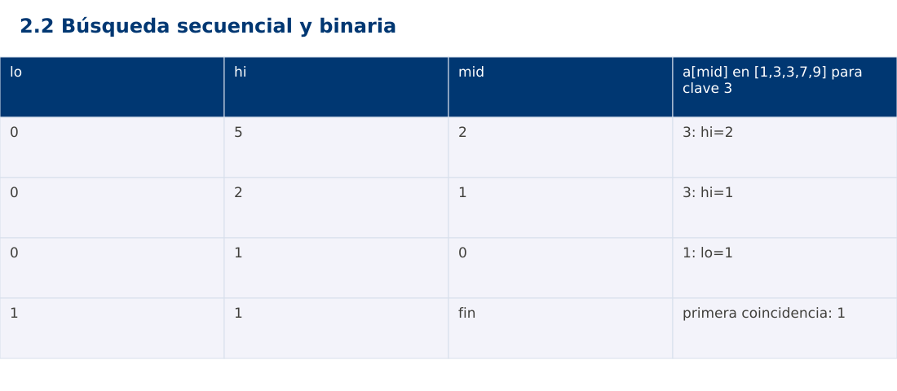

# Estructura de Datos
## 2.2 Búsqueda secuencial y binaria · Java

**Ing. Pablo Torres, Mgtr.** · Universidad Politécnica Salesiana · Computación · Cuenca  
Unidad 2: Ordenamiento, búsqueda y recursividad

[Índice del curso](../../../index.html) · [Presentación Java](../presentacion.pptx) · [Evaluación Moodle](../evaluaciones/tema.xml)

<a id="conceptos"></a>
## 1. Conceptos y ejemplos

**Prerrequisitos:** variables, condiciones, bucles, funciones y arreglos. El contenido desarrolla los conceptos adicionales que utiliza.

<a id="concepto-1"></a>
### 1.1 Contrato de búsqueda

La búsqueda recibe una secuencia y una clave. Devuelve un índice válido o -1 si la clave no está. Si hay repetidos, debe indicarse si devuelve cualquier coincidencia o la primera. En este contenido ambos métodos devuelven la primera para hacer sus resultados comparables. Los índices empiezan en cero y el método no modifica la entrada.

<a id="concepto-2"></a>
### 1.2 Recorrido secuencial

La búsqueda secuencial compara desde el inicio hasta encontrar la primera igualdad. No exige orden previo. Su mejor caso realiza una comparación y el peor visita n elementos. El caso vacío realiza cero comparaciones. Se usa cuando los datos son pequeños, cambian a menudo o no conviene pagar el costo de ordenar para una sola consulta.

<a id="concepto-3"></a>
### 1.3 Intervalo binario e invariante

La búsqueda binaria exige un arreglo ordenado según el mismo criterio de comparación. Mantenemos [lo,hi), intervalo donde aún puede estar la primera coincidencia. Si a[mid]<clave descartamos hasta mid; en otro caso conservamos mid como posible inicio y movemos hi. Al terminar lo=hi, se verifica igualdad. Esto es lower_bound: la primera posición cuyo valor no es menor que la clave.

<a id="concepto-4"></a>
### 1.4 Costo y precondición

Cada paso reduce aproximadamente a la mitad el intervalo y realiza O(1) accesos indexados. El tiempo es Θ(log n) en el peor caso y el espacio auxiliar Θ(1). Verificar que la entrada está ordenada cuesta Θ(n), por lo que se hace fuera del núcleo de búsqueda si se quiere conservar la cota por consulta. En una lista enlazada, llegar al punto medio no tiene acceso constante y el análisis cambia.

<a id="concepto-5"></a>
### 1.5 Preparación frente a consultas

Ordenar cuesta tiempo y altera la correspondencia con índices originales. Para muchas búsquedas puede compensar crear una copia ordenada con referencias a los registros. En una sola búsqueda, ordenar primero puede costar más que recorrer. La decisión debe separar preparación y consultas y considerar si llegan nuevas entradas.

<a id="traza"></a>
### Traza de referencia

| lo | hi | mid | a[mid] en [1,3,3,7,9] para clave 3 |
| --- | --- | --- | --- |
| 0 | 5 | 2 | 3: hi=2 |
| 0 | 2 | 1 | 3: hi=1 |
| 0 | 1 | 0 | 1: lo=1 |
| 1 | 1 | fin | primera coincidencia: 1 |

La tabla muestra estados o conteos concretos. Reproduce cada transición y comprueba qué propiedad permanece verdadera. Una traza finita ayuda a encontrar errores; la justificación del algoritmo también exige explicar por qué progresa y por qué la condición final satisface el contrato.



### Particularidades de Java

Java usa tipos estáticos y comprobación de tipos en compilación. int y long tienen rango fijo; los cálculos deben promoverse antes de una multiplicación que pudiera desbordar. Las referencias permiten compartir objetos y la copia de un arreglo de objetos es superficial. Las excepciones de los contratos se comprueban explícitamente. No se necesita Maven ni Gradle: el modo de archivo fuente ejecuta Demo.java con un JDK instalado.

<a id="demostracion"></a>
## 2. Demostración guiada

**Problema y contrato:** Secuencia de enteros, ordenada para binaryFirst. Devuelve primera posición o -1. No valida orden dentro de la función binaria ni modifica la entrada.

1. Lee el contrato y predice la salida del caso principal antes de ejecutar.
2. Identifica las variables que representan el estado y vincúlalas con la traza de la sección anterior.
3. Ejecuta el archivo completo. Las comprobaciones internas detienen el programa si una condición esperada falla.
4. Cambia una entrada del bloque de ejecución, predice el resultado y contrástalo. Conserva el núcleo de la demostración como referencia.

### Código completo

Este bloque se genera desde `ejemplos/Demo.java` mediante `scripts/sync-code.py`; ese archivo es la fuente del código. La PC tiene otro objetivo y sus casos de aceptación aparecen en la sección 3.

<!-- DEMO:START -->
```java
import java.util.*;

public class Demo {
    static void check(boolean ok) {
        if (!ok) throw new AssertionError("Verificación fallida");
    }
static int sequential(int[] a, int key) {
        for (int i=0; i<a.length; i++) if (a[i]==key) return i;
        return -1;
    }
    static int binaryFirst(int[] a, int key) {
        int lo=0, hi=a.length;
        while (lo<hi) {
            int mid=lo+(hi-lo)/2;
            if (a[mid]<key) lo=mid+1; else hi=mid;
        }
        return lo<a.length && a[lo]==key ? lo : -1;
    }
    public static void main(String[] args) {
        int[] a={1,3,3,7,9};
        for (int key : new int[]{3,8,1,9}) {
            check(binaryFirst(a,key)==sequential(a,key));
            System.out.println(key+":"+binaryFirst(a,key));
        }
        check(binaryFirst(new int[0],3)==-1);
    }
}
```
<!-- DEMO:END -->

### Ejecución

Desde esta carpeta `02-searching-and-sorting-algorithms/2.2-search/java`:

```bash
java ejemplos/Demo.java
```

### Salida esperada de la demostración

```text
3:1
8:-1
1:0
9:4
```

La salida procede de los datos fijos del bloque de ejecución. Las verificaciones internas también cubren los casos adicionales que se leen en el código. El registro de ejecuciones realizadas se conserva en [verificación](../../../docs/verificacion.md), separado de estas expectativas.

<a id="pc"></a>
## 3. PC — 2.2: Búsqueda secuencial y binaria

Implementa una búsqueda que devuelva el intervalo semiabierto de todas las coincidencias con dos búsquedas binarias. No recorras linealmente el bloque de duplicados. Si no hay coincidencias devuelve [-1,-1].

### Requisitos de la entrega

- Implementa la actividad en **una versión**, a tu elección entre Java, Python y JavaScript. Las PL se entregan exclusivamente en Java.
- Separa la lógica del procesamiento de la entrada y la impresión. Documenta tipos, dominio válido, salida y comportamiento de error.
- Conserva los casos de aceptación siguientes y agrega al menos un caso que compruebe el invariante del tema.
- No copies como solución el bloque de demostración: resuelve la ampliación pedida. No se suministra una solución completa de esta PC.

### Casos de aceptación de la PC

| Entrada o escenario | Resultado exigido |
| --- | --- |
| [1,3,3,3,8], clave 3 | [1,4] |
| [1,3], clave 2 | [-1,-1] |
| [], clave 1 | [-1,-1] |

### Ejecución y evidencia

Desde la carpeta de tu entrega, ejecuta el programa con `java Main.java`. Si divides Java en paquetes, utiliza los comandos de la plantilla del estudiante. Registra entrada, resultado esperado, resultado real y explicación de cualquier diferencia en `evidencias/PC2.2.md` de tu repositorio personal.

Crea commits pequeños: `feat(pc2.2): implementar contrato`, `test(pc2.2): cubrir casos limite` y `docs(pc2.2): explicar costos`. Sustituye los mensajes por descripciones del cambio real. Obtén el hash con `git rev-parse HEAD` y revisa una etapa con `git show HASH`. La actividad no necesita continuar un proyecto acumulativo.


<a id="esencial"></a>
## Lo esencial

- La búsqueda recibe una secuencia y una clave.
- Ordenar cuesta tiempo y altera la correspondencia con índices originales.
- Explica el contrato, traza una entrada y justifica tiempo y memoria con las condiciones descritas.

## Referencias

- Programa analítico y referencias del docente: correspondencia en el documento docente de este contenido.
- [Referencia técnica de Java](https://docs.oracle.com/en/java/javase/27/docs/api/).
- [Bibliografía y análisis de fuentes](../../../docs/analisis-referencias.md).
