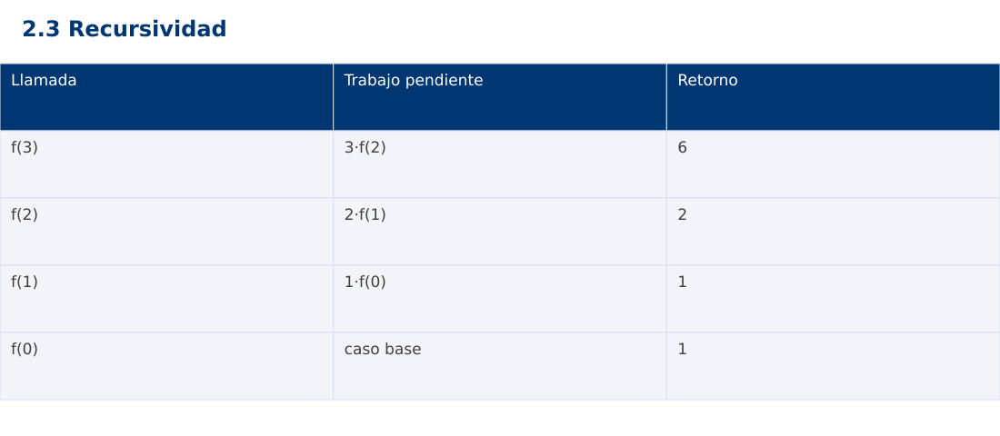

# Estructura de Datos
## 2.3 Recursividad · Python

**Ing. Pablo Torres, Mgtr.** · Universidad Politécnica Salesiana · Computación · Cuenca  
Unidad 2: Ordenamiento, búsqueda y recursividad

[Índice del curso](../../../index.html) · [Presentación Java](../presentacion.pptx) · [Evaluación Moodle](../evaluaciones/tema.xml)

<a id="conceptos"></a>
## 1. Conceptos y ejemplos

**Prerrequisitos:** variables, condiciones, bucles, funciones y arreglos. El contenido desarrolla los conceptos adicionales que utiliza.

<a id="concepto-1"></a>
### 1.1 Definición y contrato

Una función recursiva expresa un resultado usando llamadas a sí misma sobre problemas menores. Su contrato debe indicar un dominio donde la disminución llegue a un caso base. Para factorial se acepta n entero entre 0 y 20. La restricción común permite representar exactamente el resultado en long de Java y BigInt de JavaScript. Python usa enteros de precisión arbitraria, pero mantiene el mismo dominio para comparar los casos.

<a id="concepto-2"></a>
### 1.2 Caso base y terminación

factorial(0)=1 y factorial(n)=n·factorial(n-1) para n>0. La medida n es un entero no negativo que disminuye estrictamente. Esa combinación justifica la terminación. Comprobar solo n==0 sin rechazar negativos no basta: -1,-2,… nunca llega al caso base. La validación ocurre antes de llamar al núcleo recursivo.

<a id="concepto-3"></a>
### 1.3 Pila de llamadas y retorno

Cada llamada conserva sus parámetros y el trabajo que falta. Para factorial(3), las llamadas descienden 3,2,1,0 y los retornos ascienden 1,1,2,6. La multiplicación se realiza después del retorno de la llamada menor. El número de llamadas es n+1 y la profundidad también n+1. La pila ocupa Θ(n), aunque cada activación individual tenga tamaño constante.

<a id="concepto-4"></a>
### 1.4 Comparación con iteración

Un acumulador iterativo realiza n multiplicaciones y usa Θ(1) espacio auxiliar bajo palabra fija. La versión recursiva también realiza Θ(n) trabajo pero añade la pila. Recursividad no implica automáticamente ineficiencia: resulta natural en estructuras jerárquicas y divide y vencerás. Tampoco se debe asumir eliminación de llamadas de cola en estos entornos. Con entradas profundas puede agotarse la pila.

<a id="concepto-5"></a>
### 1.5 Recursión ramificada

Fibonacci ingenuo calcula dos ramas y repite estados. Su tiempo es Θ(φⁿ), con O(2ⁿ) como cota superior simple, y su profundidad es Θ(n). La cantidad total de llamadas difiere de la profundidad simultánea. En programación dinámica guardaremos estados para evitar repetición. Una función con dos llamadas no siempre es exponencial: Merge Sort divide el tamaño y tiene otro árbol de trabajo.

<a id="traza"></a>
### Traza de referencia

| Llamada | Trabajo pendiente | Retorno |
| --- | --- | --- |
| f(3) | 3·f(2) | 6 |
| f(2) | 2·f(1) | 2 |
| f(1) | 1·f(0) | 1 |
| f(0) | caso base | 1 |

La tabla muestra estados o conteos concretos. Reproduce cada transición y comprueba qué propiedad permanece verdadera. Una traza finita ayuda a encontrar errores; la justificación del algoritmo también exige explicar por qué progresa y por qué la condición final satisface el contrato.



### Particularidades de Python

Python usa indentación para delimitar bloques y enteros de precisión arbitraria. // realiza división entera para índices no negativos. list.copy() crea una copia superficial; las listas y diccionarios mutables pueden compartirse mediante referencias. Las funciones de esta demostración reciben los tipos descritos en el contrato. Los assert son comprobaciones de desarrollo y deben ejecutarse sin la opción -O. No se requieren paquetes externos.

<a id="demostracion"></a>
## 2. Demostración guiada

**Problema y contrato:** n entero entre 0 y 20 inclusive. Devuelve factorial exacto. Rechaza negativos y n>20 antes de recursar. En JavaScript usa BigInt para evitar pérdida de precisión.

1. Lee el contrato y predice la salida del caso principal antes de ejecutar.
2. Identifica las variables que representan el estado y vincúlalas con la traza de la sección anterior.
3. Ejecuta el archivo completo. Las comprobaciones internas detienen el programa si una condición esperada falla.
4. Cambia una entrada del bloque de ejecución, predice el resultado y contrástalo. Conserva el núcleo de la demostración como referencia.

### Código completo

Este bloque se genera desde `ejemplos/demo.py` mediante `scripts/sync-code.py`; ese archivo es la fuente del código. La PC tiene otro objetivo y sus casos de aceptación aparecen en la sección 3.

<!-- DEMO:START -->
```python
def validate(n):
    if not isinstance(n, int) or not 0 <= n <= 20:
        raise ValueError("n debe estar entre 0 y 20")

def factorial(n):
    validate(n)
    def recursive(k):
        return 1 if k == 0 else k * recursive(k-1)
    return recursive(n)

def iterative(n):
    validate(n)
    value = 1
    for i in range(1,n+1):
        value *= i
    return value

if __name__ == "__main__":
    for n in (0,3,5,20):
        assert factorial(n) == iterative(n)
        print(f"{n}:{factorial(n)}")
    for n in (-1,21):
        try:
            factorial(n)
            raise AssertionError("Dominio")
        except ValueError:
            pass
```
<!-- DEMO:END -->

### Ejecución

Desde esta carpeta `02-searching-and-sorting-algorithms/2.3-recursion/python`:

```bash
python3 ejemplos/demo.py
```

### Salida esperada de la demostración

```text
0:1
3:6
5:120
20:2432902008176640000
```

La salida procede de los datos fijos del bloque de ejecución. Las verificaciones internas también cubren los casos adicionales que se leen en el código. El registro de ejecuciones realizadas se conserva en [verificación](../../../docs/verificacion.md), separado de estas expectativas.

<a id="pc"></a>
## 3. PC — 2.3: Recursividad

Implementa suma de dígitos para un entero no negativo mediante recursividad, su versión iterativa y una traza de llamadas y retornos. Define el contrato para cero y rechaza negativos. Justifica costo respecto del número de dígitos.

### Requisitos de la entrega

- Implementa la actividad en **una versión**, a tu elección entre Java, Python y JavaScript. Las PL se entregan exclusivamente en Java.
- Separa la lógica del procesamiento de la entrada y la impresión. Documenta tipos, dominio válido, salida y comportamiento de error.
- Conserva los casos de aceptación siguientes y agrega al menos un caso que compruebe el invariante del tema.
- No copies como solución el bloque de demostración: resuelve la ampliación pedida. No se suministra una solución completa de esta PC.

### Casos de aceptación de la PC

| Entrada o escenario | Resultado exigido |
| --- | --- |
| 1234 | 10 |
| 0 | 0 |
| 9001 | 10 |
| -12 | error controlado |

### Ejecución y evidencia

Desde la carpeta de tu entrega, ejecuta el programa con `python3 main.py`. Si divides Java en paquetes, utiliza los comandos de la plantilla del estudiante. Registra entrada, resultado esperado, resultado real y explicación de cualquier diferencia en `evidencias/PC2.3.md` de tu repositorio personal.

Crea commits pequeños: `feat(pc2.3): implementar contrato`, `test(pc2.3): cubrir casos limite` y `docs(pc2.3): explicar costos`. Sustituye los mensajes por descripciones del cambio real. Obtén el hash con `git rev-parse HEAD` y revisa una etapa con `git show HASH`. La actividad no necesita continuar un proyecto acumulativo.


<a id="esencial"></a>
## Lo esencial

- Una función recursiva expresa un resultado usando llamadas a sí misma sobre problemas menores.
- Fibonacci ingenuo calcula dos ramas y repite estados.
- Explica el contrato, traza una entrada y justifica tiempo y memoria con las condiciones descritas.

## Referencias

- Programa analítico y referencias del docente: correspondencia en el documento docente de este contenido.
- [Referencia técnica de Python](https://docs.python.org/3.14/).
- [Bibliografía y análisis de fuentes](../../../docs/analisis-referencias.md).
