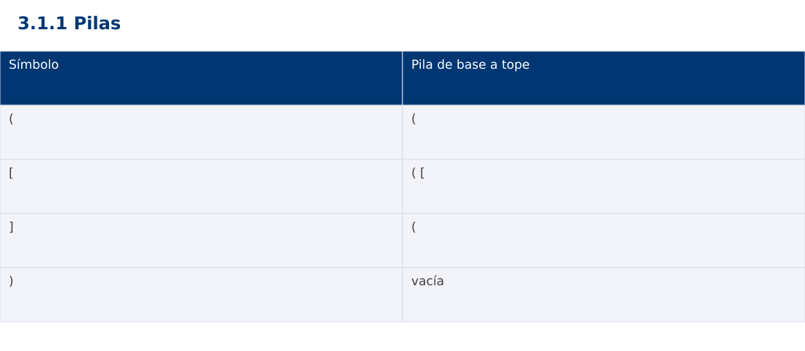

# Estructura de Datos
## 3.1.1 Pilas · JavaScript

**Ing. Pablo Torres, Mgtr.** · Universidad Politécnica Salesiana · Computación · Cuenca  
Unidad 3: Estructura de Datos y Grafos

[Índice del curso](../../../index.html) · [Presentación Java](../presentacion.pptx) · [Evaluación Moodle](../evaluaciones/tema.xml)

<a id="conceptos"></a>
## 1. Conceptos y ejemplos

**Prerrequisitos:** variables, condiciones, bucles, funciones y arreglos. Revisa las estructuras lineales antes de este contenido.

<a id="concepto-1"></a>
### 1.1 Tipo abstracto LIFO

Una pila permite insertar y retirar por un mismo extremo, llamado tope. El último valor insertado es el primero que sale. push agrega, pop extrae y peek consulta sin eliminar. La estructura abstracta define comportamiento; un arreglo dinámico o nodos enlazados son implementaciones posibles. Una pila vacía no tiene tope: el contrato debe definir error o valor ausente.

<a id="concepto-2"></a>
### 1.2 Representación y operaciones

Una pila enlazada conserva una referencia al primer nodo. push crea un nodo cuyo siguiente es el antiguo tope, y pop guarda el dato antes de avanzar al siguiente. Ambas operaciones cuestan Θ(1). Con arreglo dinámico, insertar al final cuesta O(1) amortizado y una expansión puede costar Θ(n). Retirar al final no necesita desplazar todos los elementos.

<a id="concepto-3"></a>
### 1.3 Validación de delimitadores

Al leer un delimitador de apertura se apila. Al leer un cierre debe existir una apertura y su tipo debe coincidir. Al terminar, la pila debe quedar vacía. No basta comparar cantidades: ([)] tiene tantos cierres como aperturas y aun así está mal anidado. La pila contiene exactamente las aperturas todavía no cerradas en orden de anidamiento.

<a id="concepto-4"></a>
### 1.4 Bibliotecas y errores

En Java se prefiere Deque con ArrayDeque para esta demostración; pop en vacío lanza excepción y peek devuelve null. ArrayDeque no acepta null. Python list permite append y pop al final, y pop en vacío lanza IndexError. JavaScript Array.pop devuelve undefined en vacío: debe verificarse explícitamente el tamaño para no confundir ausencia con un dato. El algoritmo valida antes de extraer y descarta caracteres que no sean delimitadores.

<a id="traza"></a>
### Traza de referencia

| Símbolo | Pila de base a tope |
| --- | --- |
| ( | ( |
| [ | ( [ |
| ] | ( |
| ) | vacía |

La tabla muestra estados o conteos concretos. Reproduce cada transición y comprueba qué propiedad permanece verdadera. Una traza finita ayuda a encontrar errores; la justificación del algoritmo también exige explicar por qué progresa y por qué la condición final satisface el contrato.



### Particularidades de JavaScript

JavaScript se ejecuta aquí con Node.js como módulo .mjs. Number solo representa exactamente enteros hasta 2^53-1; factorial usa BigInt y no mezcla su aritmética con Number. Math.floor realiza la división para índices. [...a] es una copia superficial. Map y Set expresan asociaciones y pertenencia. Los errores se verifican con condiciones explícitas, ya que console.assert no sustituye una prueba que detenga el proceso. No se requiere pnpm.

<a id="demostracion"></a>
## 2. Demostración guiada

**Problema y contrato:** Texto no nulo. Considera (), [] y {}, e ignora otros caracteres. Cadena vacía válida. Retorna falso ante cierre sin apertura o tipo incompatible.

1. Lee el contrato y predice la salida del caso principal antes de ejecutar.
2. Identifica las variables que representan el estado y vincúlalas con la traza de la sección anterior.
3. Ejecuta el archivo completo. Las comprobaciones internas detienen el programa si una condición esperada falla.
4. Cambia una entrada del bloque de ejecución, predice el resultado y contrástalo. Conserva el núcleo de la demostración como referencia.

### Código completo

Este bloque se genera desde `ejemplos/demo.mjs` mediante `scripts/sync-code.py`; ese archivo es la fuente del código. La PC tiene otro objetivo y sus casos de aceptación aparecen en la sección 3.

<!-- DEMO:START -->
```javascript
function balanced(text) {
    const stack=[], pairs=new Map([[")","("],["]","["],["}","{"]]);
    for (const c of text) {
        if ("([{ ".trim().includes(c)) stack.push(c);
        else if (pairs.has(c)) {
            if (stack.length===0 || stack.pop()!==pairs.get(c)) return false;
        }
    }
    return stack.length===0;
}
for (const [text,expected] of [["([])",true],["([)]",false],["",true],["(",false]]) {
    if (balanced(text)!==expected) throw new Error("Balance");
    console.log(balanced(text)?"valido":"invalido");
}
```
<!-- DEMO:END -->

### Ejecución

Desde esta carpeta `03-data-structures/3.1.1-stacks/js`:

```bash
node ejemplos/demo.mjs
```

### Salida esperada de la demostración

```text
valido
invalido
valido
invalido
```

La salida procede de los datos fijos del bloque de ejecución. Las verificaciones internas también cubren los casos adicionales que se leen en el código. El registro de ejecuciones realizadas se conserva en [verificación](../../../docs/verificacion.md), separado de estas expectativas.

<a id="pc"></a>
## 3. PC — 3.1.1: Pilas

Implementa un historial de acciones con dos pilas: deshacer y rehacer. Ejecutar una acción nueva debe vaciar rehacer. Define el comportamiento de operaciones vacías y conserva el estado al rechazarlas.

### Requisitos de la entrega

- Implementa la actividad en **una versión**, a tu elección entre Java, Python y JavaScript. Las PL se entregan exclusivamente en Java.
- Separa la lógica del procesamiento de la entrada y la impresión. Documenta tipos, dominio válido, salida y comportamiento de error.
- Conserva los casos de aceptación siguientes y agrega al menos un caso que compruebe el invariante del tema.
- No copies como solución el bloque de demostración: resuelve la ampliación pedida. No se suministra una solución completa de esta PC.

### Casos de aceptación de la PC

| Entrada o escenario | Resultado exigido |
| --- | --- |
| ejecutar A, B; deshacer | estado A; B disponible para rehacer |
| deshacer; ejecutar C | rehacer queda vacío |
| deshacer en historial vacío | mensaje de operación no disponible |

### Ejecución y evidencia

Desde la carpeta de tu entrega, ejecuta el programa con `node main.mjs`. Si divides Java en paquetes, utiliza los comandos de la plantilla del estudiante. Registra entrada, resultado esperado, resultado real y explicación de cualquier diferencia en `evidencias/PC3.1.1.md` de tu repositorio personal.

Crea commits pequeños: `feat(pc3.1.1): implementar contrato`, `test(pc3.1.1): cubrir casos limite` y `docs(pc3.1.1): explicar costos`. Sustituye los mensajes por descripciones del cambio real. Obtén el hash con `git rev-parse HEAD` y revisa una etapa con `git show HASH`. La actividad no necesita continuar un proyecto acumulativo.


<a id="esencial"></a>
## Lo esencial

- Una pila permite insertar y retirar por un mismo extremo, llamado tope.
- En Java se prefiere Deque con ArrayDeque para esta demostración; pop en vacío lanza excepción y peek devuelve null.
- Explica el contrato, traza una entrada y justifica tiempo y memoria con las condiciones descritas.

## Referencias

- Programa analítico y referencias del docente: correspondencia en el documento docente de este contenido.
- [Referencia técnica de JavaScript](https://developer.mozilla.org/en-US/docs/Web/JavaScript/Reference).
- [Bibliografía y análisis de fuentes](../../../docs/analisis-referencias.md).
