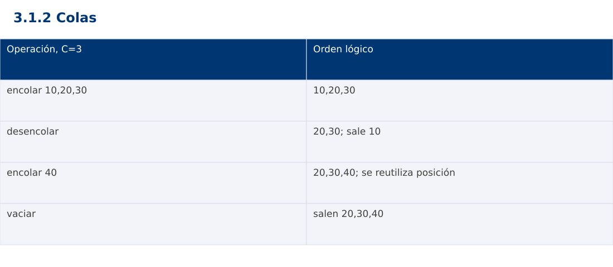

# Estructura de Datos
## 3.1.2 Colas · Python

**Ing. Pablo Torres, Mgtr.** · Universidad Politécnica Salesiana · Computación · Cuenca  
Unidad 3: Estructura de Datos y Grafos

[Índice del curso](../../../index.html) · [Presentación Java](../presentacion.pptx) · [Evaluación Moodle](../evaluaciones/tema.xml)

<a id="conceptos"></a>
## 1. Conceptos y ejemplos

**Prerrequisitos:** variables, condiciones, bucles, funciones y arreglos. Revisa las estructuras lineales antes de este contenido.

<a id="concepto-1"></a>
### 1.1 Tipo abstracto FIFO

Una cola agrega al final y retira por el frente. El primero en ingresar es el primero en salir. Se usa en atención de turnos, recorridos por niveles y procesamiento de tareas. Enqueue agrega, dequeue retira y front consulta. Una cola de prioridad usa otro criterio de salida y no debe confundirse con FIFO.

<a id="concepto-2"></a>
### 1.2 Arreglo circular acotado

Se reserva una capacidad C positiva, un índice head y un tamaño size. La próxima inserción va a (head+size) mod C. Retirar avanza head=(head+1) mod C y reduce size. size=0 indica vacío y size=C indica lleno. Esta representación utiliza todas las posiciones sin ambigüedad entre lleno y vacío. Una inserción rechazada por llenado no debe sobrescribir datos.

<a id="concepto-3"></a>
### 1.3 Invariantes y referencias

El tamaño permanece entre 0 y C y los índices válidos entre 0 y C-1. El frente conserva el elemento más antiguo aún no retirado. Al extraer, se limpia la posición para liberar referencias a objetos. head puede avanzar y volver a cero sin mover físicamente todos los datos. Cada operación cuesta Θ(1) y el almacenamiento reservado Θ(C).

<a id="concepto-4"></a>
### 1.4 Alternativas de biblioteca

ArrayDeque en Java y collections.deque en Python evitan desplazar todos los elementos al retirar por el frente. JavaScript no ofrece una cola FIFO estándar especializada; Array.shift puede desplazar posiciones y no sustenta por sí solo una garantía constante. La demostración implementa el mismo buffer circular en los tres lenguajes. En sistemas reales deben definirse además concurrencia y política de desbordamiento; aquí la ejecución es secuencial.

<a id="traza"></a>
### Traza de referencia

| Operación, C=3 | Orden lógico |
| --- | --- |
| encolar 10,20,30 | 10,20,30 |
| desencolar | 20,30; sale 10 |
| encolar 40 | 20,30,40; se reutiliza posición |
| vaciar | salen 20,30,40 |

La tabla muestra estados o conteos concretos. Reproduce cada transición y comprueba qué propiedad permanece verdadera. Una traza finita ayuda a encontrar errores; la justificación del algoritmo también exige explicar por qué progresa y por qué la condición final satisface el contrato.



### Particularidades de Python

Python usa indentación para delimitar bloques y enteros de precisión arbitraria. // realiza división entera para índices no negativos. list.copy() crea una copia superficial; las listas y diccionarios mutables pueden compartirse mediante referencias. Las funciones de esta demostración reciben los tipos descritos en el contrato. Los assert son comprobaciones de desarrollo y deben ejecutarse sin la opción -O. No se requieren paquetes externos.

<a id="demostracion"></a>
## 2. Demostración guiada

**Problema y contrato:** Capacidad entera positiva; encola enteros. Lleno y vacío producen errores específicos sin alterar el orden. Ejemplo de capacidad 3 con reutilización del buffer.

1. Lee el contrato y predice la salida del caso principal antes de ejecutar.
2. Identifica las variables que representan el estado y vincúlalas con la traza de la sección anterior.
3. Ejecuta el archivo completo. Las comprobaciones internas detienen el programa si una condición esperada falla.
4. Cambia una entrada del bloque de ejecución, predice el resultado y contrástalo. Conserva el núcleo de la demostración como referencia.

### Código completo

Este bloque se genera desde `ejemplos/demo.py` mediante `scripts/sync-code.py`; ese archivo es la fuente del código. La PC tiene otro objetivo y sus casos de aceptación aparecen en la sección 3.

<!-- DEMO:START -->
```python
class Queue:
    def __init__(self, capacity):
        if capacity <= 0:
            raise ValueError('capacidad')
        self.data = [None] * capacity
        self.head = self.size = 0
    def add(self, value):
        if self.size == len(self.data):
            raise OverflowError('llena')
        self.data[(self.head+self.size) % len(self.data)] = value
        self.size += 1
    def remove(self):
        if self.size == 0:
            raise IndexError('vacía')
        value = self.data[self.head]
        self.data[self.head] = None
        self.head = (self.head+1) % len(self.data)
        self.size -= 1
        return value

if __name__ == '__main__':
    q = Queue(3)
    for value in (10,20,30):
        q.add(value)
    try:
        q.add(99)
        raise AssertionError('Llena')
    except OverflowError:
        pass
    assert q.size == 3
    print(q.remove())
    q.add(40)
    for expected in (20,30,40):
        value = q.remove()
        assert value == expected
        print(value)
    try:
        q.remove()
        raise AssertionError('Vacía')
    except IndexError:
        pass
    try:
        Queue(0)
        raise AssertionError('Capacidad')
    except ValueError:
        pass
```
<!-- DEMO:END -->

### Ejecución

Desde esta carpeta `03-data-structures/3.1.2-queues/python`:

```bash
python3 ejemplos/demo.py
```

### Salida esperada de la demostración

```text
10
20
30
40
```

La salida procede de los datos fijos del bloque de ejecución. Las verificaciones internas también cubren los casos adicionales que se leen en el código. El registro de ejecuciones realizadas se conserva en [verificación](../../../docs/verificacion.md), separado de estas expectativas.

<a id="pc"></a>
## 3. PC — 3.1.2: Colas

Construye un simulador de turnos con cola circular de capacidad configurable. Incluye agregar, atender, consultar siguiente y listar en orden lógico. Rechaza capacidad cero y atiende correctamente después de dar varias vueltas al buffer.

### Requisitos de la entrega

- Implementa la actividad en **una versión**, a tu elección entre Java, Python y JavaScript. Las PL se entregan exclusivamente en Java.
- Separa la lógica del procesamiento de la entrada y la impresión. Documenta tipos, dominio válido, salida y comportamiento de error.
- Conserva los casos de aceptación siguientes y agrega al menos un caso que compruebe el invariante del tema.
- No copies como solución el bloque de demostración: resuelve la ampliación pedida. No se suministra una solución completa de esta PC.

### Casos de aceptación de la PC

| Entrada o escenario | Resultado exigido |
| --- | --- |
| C=2; agregar A,B,C | A,B; C rechazado sin cambios |
| atender A; agregar C | orden B,C |
| atender vacía | error controlado |

### Ejecución y evidencia

Desde la carpeta de tu entrega, ejecuta el programa con `python3 main.py`. Si divides Java en paquetes, utiliza los comandos de la plantilla del estudiante. Registra entrada, resultado esperado, resultado real y explicación de cualquier diferencia en `evidencias/PC3.1.2.md` de tu repositorio personal.

Crea commits pequeños: `feat(pc3.1.2): implementar contrato`, `test(pc3.1.2): cubrir casos limite` y `docs(pc3.1.2): explicar costos`. Sustituye los mensajes por descripciones del cambio real. Obtén el hash con `git rev-parse HEAD` y revisa una etapa con `git show HASH`. La actividad no necesita continuar un proyecto acumulativo.


<a id="esencial"></a>
## Lo esencial

- Una cola agrega al final y retira por el frente.
- ArrayDeque en Java y collections.deque en Python evitan desplazar todos los elementos al retirar por el frente.
- Explica el contrato, traza una entrada y justifica tiempo y memoria con las condiciones descritas.

## Referencias

- Programa analítico y referencias del docente: correspondencia en el documento docente de este contenido.
- [Referencia técnica de Python](https://docs.python.org/3.14/).
- [Bibliografía y análisis de fuentes](../../../docs/analisis-referencias.md).
