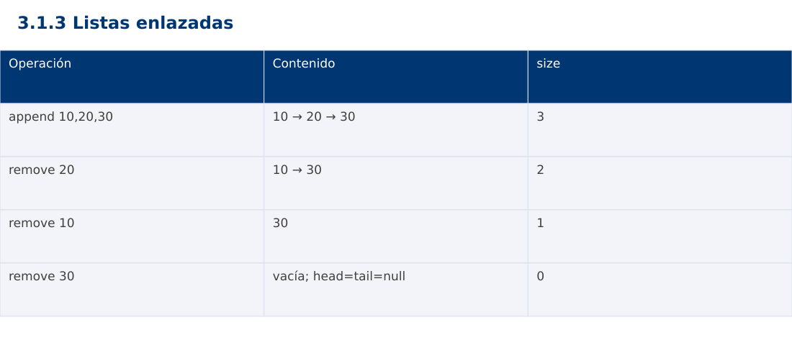

# Estructura de Datos
## 3.1.3 Listas enlazadas · JavaScript

**Ing. Pablo Torres, Mgtr.** · Universidad Politécnica Salesiana · Computación · Cuenca  
Unidad 3: Estructura de Datos y Grafos

[Índice del curso](../../../index.html) · [Presentación Java](../presentacion.pptx) · [Evaluación Moodle](../evaluaciones/tema.xml)

<a id="conceptos"></a>
## 1. Conceptos y ejemplos

**Prerrequisitos:** variables, condiciones, bucles, funciones y arreglos. Revisa las estructuras lineales antes de este contenido.

<a id="concepto-1"></a>
### 1.1 Nodos y enlaces

Una lista enlazada simple consta de nodos con dato y referencia siguiente. head identifica el inicio y null marca el final. Los nodos no necesitan ocupar direcciones contiguas. Recorrer la lista sigue enlaces hasta el final. Acceder por índice i exige avanzar i enlaces y cuesta Θ(i+1), mientras que un arreglo permite acceso directo.

<a id="concepto-2"></a>
### 1.2 Inserción y eliminación

Insertar al inicio cuesta Θ(1). Insertar al final cuesta Θ(1) si se mantiene tail y Θ(n) si se busca el último cada vez. Eliminar un nodo conocido requiere conocer su predecesor en una lista simple para reconectar enlaces. Buscar por valor cuesta Θ(n); no se debe anunciar eliminación constante cuando incluye esa búsqueda. El caso de eliminar head requiere actualizar la referencia de inicio.

<a id="concepto-3"></a>
### 1.3 Invariantes de head, tail y size

Lista vacía significa head=tail=null y size=0. Si hay elementos, tail.next=null. Al retirar el último nodo, ambas referencias vuelven a null. size coincide con la cantidad alcanzable desde head. Si se pierde un enlace antes de guardar su siguiente, se puede perder el resto de la lista. Para depurar, dibuja el estado antes y después de cada modificación.

<a id="concepto-4"></a>
### 1.4 Variantes y elección

Una lista doble añade previous y facilita retroceder o eliminar un nodo conocido, a cambio de memoria y más enlaces que mantener. Una lista circular conecta el último con el primero y necesita un criterio de parada explícito. Un arreglo dinámico suele favorecer acceso aleatorio y localidad de memoria. Las listas son adecuadas cuando importan modificaciones mediante referencias a nodos y el acceso secuencial domina.

<a id="traza"></a>
### Traza de referencia

| Operación | Contenido | size |
| --- | --- | --- |
| append 10,20,30 | 10 → 20 → 30 | 3 |
| remove 20 | 10 → 30 | 2 |
| remove 10 | 30 | 1 |
| remove 30 | vacía; head=tail=null | 0 |

La tabla muestra estados o conteos concretos. Reproduce cada transición y comprueba qué propiedad permanece verdadera. Una traza finita ayuda a encontrar errores; la justificación del algoritmo también exige explicar por qué progresa y por qué la condición final satisface el contrato.



### Particularidades de JavaScript

JavaScript se ejecuta aquí con Node.js como módulo .mjs. Number solo representa exactamente enteros hasta 2^53-1; factorial usa BigInt y no mezcla su aritmética con Number. Math.floor realiza la división para índices. [...a] es una copia superficial. Map y Set expresan asociaciones y pertenencia. Los errores se verifican con condiciones explícitas, ya que console.assert no sustituye una prueba que detenga el proceso. No se requiere pnpm.

<a id="demostracion"></a>
## 2. Demostración guiada

**Problema y contrato:** Lista simple de enteros. add inserta al final; remove elimina la primera coincidencia y devuelve booleano. Ausencia no modifica la lista. values crea una copia para observación.

1. Lee el contrato y predice la salida del caso principal antes de ejecutar.
2. Identifica las variables que representan el estado y vincúlalas con la traza de la sección anterior.
3. Ejecuta el archivo completo. Las comprobaciones internas detienen el programa si una condición esperada falla.
4. Cambia una entrada del bloque de ejecución, predice el resultado y contrástalo. Conserva el núcleo de la demostración como referencia.

### Código completo

Este bloque se genera desde `ejemplos/demo.mjs` mediante `scripts/sync-code.py`; ese archivo es la fuente del código. La PC tiene otro objetivo y sus casos de aceptación aparecen en la sección 3.

<!-- DEMO:START -->
```javascript
class Node { constructor(value) { this.value=value; this.next=null; } }
class Chain {
    constructor() { this.head=null; this.tail=null; this.size=0; }
    add(value) {
        const node=new Node(value);
        if (this.tail===null) this.head=node; else this.tail.next=node;
        this.tail=node; this.size++;
    }
    remove(value) {
        let prev=null, cur=this.head;
        while (cur!==null && cur.value!==value) { prev=cur; cur=cur.next; }
        if (cur===null) return false;
        if (prev===null) this.head=cur.next; else prev.next=cur.next;
        if (cur===this.tail) this.tail=prev;
        this.size--; return true;
    }
    values() {
        const out=[];
        for (let cur=this.head;cur!==null;cur=cur.next) out.push(cur.value);
        return out;
    }
}
const c=new Chain(); [10,20,30].forEach(x=>c.add(x));
if (!c.remove(20) || c.remove(99)) throw new Error('Eliminación');
if (JSON.stringify(c.values())!=='[10,30]') throw new Error('Contenido');
console.log(`[${c.values().join(', ')}]`);
if (!c.remove(10) || !c.remove(30) || c.head!==null || c.tail!==null || c.size!==0)
    throw new Error('Vacío inconsistente');
console.log(c.size);
```
<!-- DEMO:END -->

### Ejecución

Desde esta carpeta `03-data-structures/3.1.3-linked-lists/js`:

```bash
node ejemplos/demo.mjs
```

### Salida esperada de la demostración

```text
[10, 30]
0
```

La salida procede de los datos fijos del bloque de ejecución. Las verificaciones internas también cubren los casos adicionales que se leen en el código. El registro de ejecuciones realizadas se conserva en [verificación](../../../docs/verificacion.md), separado de estas expectativas.

<a id="pc"></a>
## 3. PC — 3.1.3: Listas enlazadas

Implementa una lista de tareas con inserción al inicio, al final y eliminación por identificador. Añade reverse iterativo sin crear nodos nuevos. Verifica los invariantes de head, tail y tamaño después de cada operación.

### Requisitos de la entrega

- Implementa la actividad en **una versión**, a tu elección entre Java, Python y JavaScript. Las PL se entregan exclusivamente en Java.
- Separa la lógica del procesamiento de la entrada y la impresión. Documenta tipos, dominio válido, salida y comportamiento de error.
- Conserva los casos de aceptación siguientes y agrega al menos un caso que compruebe el invariante del tema.
- No copies como solución el bloque de demostración: resuelve la ampliación pedida. No se suministra una solución completa de esta PC.

### Casos de aceptación de la PC

| Entrada o escenario | Resultado exigido |
| --- | --- |
| 10,20,30; reverse | 30,20,10; tail=10 |
| eliminar único elemento | head=tail=null; size=0 |
| eliminar ID ausente | false; lista intacta |

### Ejecución y evidencia

Desde la carpeta de tu entrega, ejecuta el programa con `node main.mjs`. Si divides Java en paquetes, utiliza los comandos de la plantilla del estudiante. Registra entrada, resultado esperado, resultado real y explicación de cualquier diferencia en `evidencias/PC3.1.3.md` de tu repositorio personal.

Crea commits pequeños: `feat(pc3.1.3): implementar contrato`, `test(pc3.1.3): cubrir casos limite` y `docs(pc3.1.3): explicar costos`. Sustituye los mensajes por descripciones del cambio real. Obtén el hash con `git rev-parse HEAD` y revisa una etapa con `git show HASH`. La actividad no necesita continuar un proyecto acumulativo.


<a id="esencial"></a>
## Lo esencial

- Una lista enlazada simple consta de nodos con dato y referencia siguiente.
- Una lista doble añade previous y facilita retroceder o eliminar un nodo conocido, a cambio de memoria y más enlaces que mantener.
- Explica el contrato, traza una entrada y justifica tiempo y memoria con las condiciones descritas.

## Referencias

- Programa analítico y referencias del docente: correspondencia en el documento docente de este contenido.
- [Referencia técnica de JavaScript](https://developer.mozilla.org/en-US/docs/Web/JavaScript/Reference).
- [Bibliografía y análisis de fuentes](../../../docs/analisis-referencias.md).
