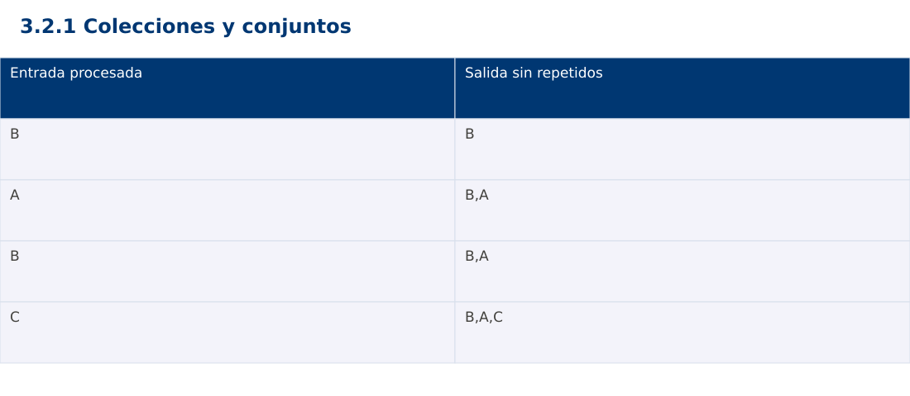

# Estructura de Datos
## 3.2.1 Colecciones y conjuntos · JavaScript

**Ing. Pablo Torres, Mgtr.** · Universidad Politécnica Salesiana · Computación · Cuenca  
Unidad 3: Estructura de Datos y Grafos

[Índice del curso](../../../index.html) · [Presentación Java](../presentacion.pptx) · [Evaluación Moodle](../evaluaciones/tema.xml)

<a id="conceptos"></a>
## 1. Conceptos y ejemplos

**Prerrequisitos:** variables, condiciones, bucles, funciones y arreglos. Revisa las estructuras lineales antes de este contenido.

<a id="concepto-1"></a>
### 1.1 Interfaces y significado

Una colección agrupa elementos y ofrece operaciones de consulta y modificación. Una lista preserva una secuencia y permite repetidos. Un conjunto representa pertenencia sin duplicados. Un mapa asocia claves y valores y se estudia en el siguiente tema. En Java Map no hereda de Collection, aunque forma parte del framework de colecciones. Elegir una estructura empieza por las operaciones que necesita el problema.

<a id="concepto-2"></a>
### 1.2 Igualdad y unicidad

El criterio de igualdad determina qué valores se consideran duplicados. Java combina equals y hashCode en conjuntos hash; objetos iguales deben tener el mismo hash. Python exige claves hashables y coherencia entre igualdad y hash. JavaScript Set compara primitivas por SameValueZero y objetos por identidad. Dos objetos distintos con campos iguales no se deduplican automáticamente en JavaScript.

<a id="concepto-3"></a>
### 1.3 Orden de iteración

Un HashSet de Java no garantiza orden. LinkedHashSet conserva el orden de inserción. El set de Python tampoco promete una secuencia para la salida; si el contrato requiere orden hay que construirla explícitamente. JavaScript Set mantiene inserción. La demostración usa lista de salida más conjunto de vistos para conservar la primera aparición de cada código de forma equivalente.

<a id="concepto-4"></a>
### 1.4 Costo y operaciones de conjuntos

En estructuras hash habituales, pertenencia e inserción tienen costo esperado constante bajo buena dispersión, pero no una garantía universal. La deduplicación esperada cuesta Θ(n) y reserva Θ(u) memoria para u códigos únicos, además de la salida. Unión reúne valores; intersección conserva los presentes en ambos; diferencia conserva los del primero ausentes en el segundo. Mutar mientras se itera puede invalidar el recorrido o producir resultados difíciles de razonar.

<a id="traza"></a>
### Traza de referencia

| Entrada procesada | Salida sin repetidos |
| --- | --- |
| B | B |
| A | B,A |
| B | B,A |
| C | B,A,C |

La tabla muestra estados o conteos concretos. Reproduce cada transición y comprueba qué propiedad permanece verdadera. Una traza finita ayuda a encontrar errores; la justificación del algoritmo también exige explicar por qué progresa y por qué la condición final satisface el contrato.



### Particularidades de JavaScript

JavaScript se ejecuta aquí con Node.js como módulo .mjs. Number solo representa exactamente enteros hasta 2^53-1; factorial usa BigInt y no mezcla su aritmética con Number. Math.floor realiza la división para índices. [...a] es una copia superficial. Map y Set expresan asociaciones y pertenencia. Los errores se verifican con condiciones explícitas, ya que console.assert no sustituye una prueba que detenga el proceso. No se requiere pnpm.

<a id="demostracion"></a>
## 2. Demostración guiada

**Problema y contrato:** Secuencia de códigos de texto no nulos. Devuelve una nueva lista de valores únicos conservando la primera aparición. No modifica la entrada.

1. Lee el contrato y predice la salida del caso principal antes de ejecutar.
2. Identifica las variables que representan el estado y vincúlalas con la traza de la sección anterior.
3. Ejecuta el archivo completo. Las comprobaciones internas detienen el programa si una condición esperada falla.
4. Cambia una entrada del bloque de ejecución, predice el resultado y contrástalo. Conserva el núcleo de la demostración como referencia.

### Código completo

Este bloque se genera desde `ejemplos/demo.mjs` mediante `scripts/sync-code.py`; ese archivo es la fuente del código. La PC tiene otro objetivo y sus casos de aceptación aparecen en la sección 3.

<!-- DEMO:START -->
```javascript
function unique(values) {
    const seen=new Set(), out=[];
    for (const value of values) if (!seen.has(value)) { seen.add(value); out.push(value); }
    return out;
}
const out=unique(['B','A','B','C','A']);
if (out.join(',')!=='B,A,C' || unique([]).length!==0) throw new Error('Unicidad');
console.log(out.join(','));
```
<!-- DEMO:END -->

### Ejecución

Desde esta carpeta `03-data-structures/3.2.1-collections/js`:

```bash
node ejemplos/demo.mjs
```

### Salida esperada de la demostración

```text
B,A,C
```

La salida procede de los datos fijos del bloque de ejecución. Las verificaciones internas también cubren los casos adicionales que se leen en el código. El registro de ejecuciones realizadas se conserva en [verificación](../../../docs/verificacion.md), separado de estas expectativas.

<a id="pc"></a>
## 3. PC — 3.2.1: Colecciones y conjuntos

Calcula inscritos comunes, exclusivos y unión de dos cursos. La salida debe seguir el orden de primera aparición: para la unión, primero los del curso A y luego los nuevos del B. Documenta igualdad por código.

### Requisitos de la entrega

- Implementa la actividad en **una versión**, a tu elección entre Java, Python y JavaScript. Las PL se entregan exclusivamente en Java.
- Separa la lógica del procesamiento de la entrada y la impresión. Documenta tipos, dominio válido, salida y comportamiento de error.
- Conserva los casos de aceptación siguientes y agrega al menos un caso que compruebe el invariante del tema.
- No copies como solución el bloque de demostración: resuelve la ampliación pedida. No se suministra una solución completa de esta PC.

### Casos de aceptación de la PC

| Entrada o escenario | Resultado exigido |
| --- | --- |
| A=[P,Q,P], B=[Q,R] | intersección [Q]; unión [P,Q,R] |
| A=[], B=[R] | intersección []; unión [R] |
| A=[P], B=[P] | exclusivos vacíos |

### Ejecución y evidencia

Desde la carpeta de tu entrega, ejecuta el programa con `node main.mjs`. Si divides Java en paquetes, utiliza los comandos de la plantilla del estudiante. Registra entrada, resultado esperado, resultado real y explicación de cualquier diferencia en `evidencias/PC3.2.1.md` de tu repositorio personal.

Crea commits pequeños: `feat(pc3.2.1): implementar contrato`, `test(pc3.2.1): cubrir casos limite` y `docs(pc3.2.1): explicar costos`. Sustituye los mensajes por descripciones del cambio real. Obtén el hash con `git rev-parse HEAD` y revisa una etapa con `git show HASH`. La actividad no necesita continuar un proyecto acumulativo.


<a id="esencial"></a>
## Lo esencial

- Una colección agrupa elementos y ofrece operaciones de consulta y modificación.
- En estructuras hash habituales, pertenencia e inserción tienen costo esperado constante bajo buena dispersión, pero no una garantía universal.
- Explica el contrato, traza una entrada y justifica tiempo y memoria con las condiciones descritas.

## Referencias

- Programa analítico y referencias del docente: correspondencia en el documento docente de este contenido.
- [Referencia técnica de JavaScript](https://developer.mozilla.org/en-US/docs/Web/JavaScript/Reference).
- [Bibliografía y análisis de fuentes](../../../docs/analisis-referencias.md).
