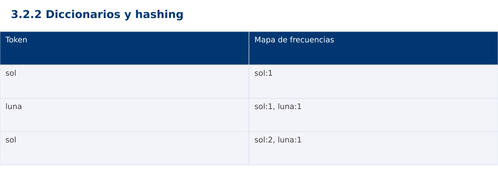

# Estructura de Datos
## 3.2.2 Diccionarios y hashing · Java

**Ing. Pablo Torres, Mgtr.** · Universidad Politécnica Salesiana · Computación · Cuenca  
Unidad 3: Estructura de Datos y Grafos

[Índice del curso](../../../index.html) · [Presentación Java](../presentacion.pptx) · [Evaluación Moodle](../evaluaciones/tema.xml)

<a id="conceptos"></a>
## 1. Conceptos y ejemplos

**Prerrequisitos:** variables, condiciones, bucles, funciones y arreglos. Revisa las estructuras lineales antes de este contenido.

<a id="concepto-1"></a>
### 1.1 Asociación clave y valor

Un diccionario permite consultar un valor por clave. Cada clave aparece una vez; asignarle otro valor actualiza la asociación. Distintas claves pueden compartir el mismo valor. El contrato debe distinguir ausencia de valores válidos como cero o null. Consultar por clave normalmente evita recorrer todos los pares.

<a id="concepto-2"></a>
### 1.2 Hash y colisiones

Una función hash transforma la clave en información para seleccionar una región de almacenamiento. Claves diferentes pueden producir el mismo hash y eso no las convierte en iguales. Las tablas resuelven colisiones mediante mecanismos como encadenamiento o direccionamiento abierto. El factor de carga relaciona cantidad de entradas y capacidad. Redimensionar redistribuye entradas y tiene costo lineal, aunque el costo esperado de muchas operaciones pueda ser constante.

<a id="concepto-3"></a>
### 1.3 Conteo de frecuencias

Para cada palabra se consulta su contador anterior, usando cero solo si está ausente, y se guarda contador+1. Tras procesar el prefijo, cada valor del mapa es la frecuencia exacta en ese prefijo. El algoritmo esperado es Θ(n), más el costo de procesar y comparar claves. Con palabras de longitud variable no siempre conviene ignorar ese costo. El ejemplo fija tokens breves y sensibles a mayúsculas.

<a id="concepto-4"></a>
### 1.4 Claves mutables y salidas

En Java no deben mutarse campos que participan en equals/hashCode mientras el objeto sea clave. Python permite solo claves hashables. En JavaScript Map admite objetos por identidad y evita confundir nombres de propiedades con claves de datos. Para comparar salidas entre versiones, el ejemplo ordena alfabéticamente las claves al imprimir. Ese ordenamiento añade O(u log u) para u claves distintas, separado del conteo.

<a id="traza"></a>
### Traza de referencia

| Token | Mapa de frecuencias |
| --- | --- |
| sol | sol:1 |
| luna | sol:1, luna:1 |
| sol | sol:2, luna:1 |

La tabla muestra estados o conteos concretos. Reproduce cada transición y comprueba qué propiedad permanece verdadera. Una traza finita ayuda a encontrar errores; la justificación del algoritmo también exige explicar por qué progresa y por qué la condición final satisface el contrato.



### Particularidades de Java

Java usa tipos estáticos y comprobación de tipos en compilación. int y long tienen rango fijo; los cálculos deben promoverse antes de una multiplicación que pudiera desbordar. Las referencias permiten compartir objetos y la copia de un arreglo de objetos es superficial. Las excepciones de los contratos se comprueban explícitamente. No se necesita Maven ni Gradle: el modo de archivo fuente ejecuta Demo.java con un JDK instalado.

<a id="demostracion"></a>
## 2. Demostración guiada

**Problema y contrato:** Lista de tokens de texto no nulos. Conteo sensible a mayúsculas; no tokeniza texto libre. La impresión ordena claves para hacer la salida reproducible.

1. Lee el contrato y predice la salida del caso principal antes de ejecutar.
2. Identifica las variables que representan el estado y vincúlalas con la traza de la sección anterior.
3. Ejecuta el archivo completo. Las comprobaciones internas detienen el programa si una condición esperada falla.
4. Cambia una entrada del bloque de ejecución, predice el resultado y contrástalo. Conserva el núcleo de la demostración como referencia.

### Código completo

Este bloque se genera desde `ejemplos/Demo.java` mediante `scripts/sync-code.py`; ese archivo es la fuente del código. La PC tiene otro objetivo y sus casos de aceptación aparecen en la sección 3.

<!-- DEMO:START -->
```java
import java.util.*;

public class Demo {
    static void check(boolean ok) {
        if (!ok) throw new AssertionError("Verificación fallida");
    }
static Map<String,Integer> frequencies(List<String> tokens) {
        Map<String,Integer> counts=new HashMap<>();
        for (String token:tokens) counts.put(token, counts.getOrDefault(token,0)+1);
        return counts;
    }
    public static void main(String[] args) {
        Map<String,Integer> m=frequencies(Arrays.asList("sol","luna","sol"));
        check(m.get("sol")==2 && m.get("luna")==1 && !m.containsKey("mar"));
        check(frequencies(Collections.emptyList()).isEmpty());
        for (String key:new TreeSet<>(m.keySet())) System.out.println(key+":"+m.get(key));
    }
}
```
<!-- DEMO:END -->

### Ejecución

Desde esta carpeta `03-data-structures/3.2.2-maps/java`:

```bash
java ejemplos/Demo.java
```

### Salida esperada de la demostración

```text
luna:1
sol:2
```

La salida procede de los datos fijos del bloque de ejecución. Las verificaciones internas también cubren los casos adicionales que se leen en el código. El registro de ejecuciones realizadas se conserva en [verificación](../../../docs/verificacion.md), separado de estas expectativas.

<a id="pc"></a>
## 3. PC — 3.2.2: Diccionarios y hashing

Construye un índice invertido: palabra → identificadores de documentos que la contienen. No repitas un ID aunque la palabra aparezca varias veces en el mismo documento. Normaliza a minúsculas y define cómo separas palabras.

### Requisitos de la entrega

- Implementa la actividad en **una versión**, a tu elección entre Java, Python y JavaScript. Las PL se entregan exclusivamente en Java.
- Separa la lógica del procesamiento de la entrada y la impresión. Documenta tipos, dominio válido, salida y comportamiento de error.
- Conserva los casos de aceptación siguientes y agrega al menos un caso que compruebe el invariante del tema.
- No copies como solución el bloque de demostración: resuelve la ampliación pedida. No se suministra una solución completa de esta PC.

### Casos de aceptación de la PC

| Entrada o escenario | Resultado exigido |
| --- | --- |
| D1: sol sol; D2: luna sol | sol:[D1,D2]; luna:[D2] |
| documento vacío | no agrega claves |
| consulta ausente | lista vacía sin modificar el índice |

### Ejecución y evidencia

Desde la carpeta de tu entrega, ejecuta el programa con `java Main.java`. Si divides Java en paquetes, utiliza los comandos de la plantilla del estudiante. Registra entrada, resultado esperado, resultado real y explicación de cualquier diferencia en `evidencias/PC3.2.2.md` de tu repositorio personal.

Crea commits pequeños: `feat(pc3.2.2): implementar contrato`, `test(pc3.2.2): cubrir casos limite` y `docs(pc3.2.2): explicar costos`. Sustituye los mensajes por descripciones del cambio real. Obtén el hash con `git rev-parse HEAD` y revisa una etapa con `git show HASH`. La actividad no necesita continuar un proyecto acumulativo.


<a id="esencial"></a>
## Lo esencial

- Un diccionario permite consultar un valor por clave.
- En Java no deben mutarse campos que participan en equals/hashCode mientras el objeto sea clave.
- Explica el contrato, traza una entrada y justifica tiempo y memoria con las condiciones descritas.

## Referencias

- Programa analítico y referencias del docente: correspondencia en el documento docente de este contenido.
- [Referencia técnica de Java](https://docs.oracle.com/en/java/javase/27/docs/api/).
- [Bibliografía y análisis de fuentes](../../../docs/analisis-referencias.md).
