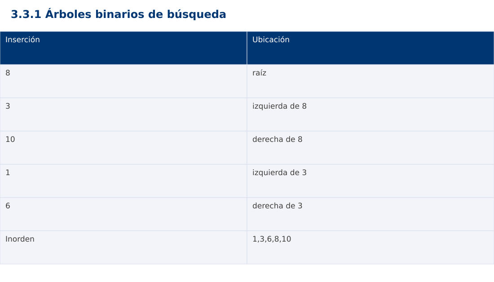

# Estructura de Datos
## 3.3.1 Árboles binarios de búsqueda · Java

**Ing. Pablo Torres, Mgtr.** · Universidad Politécnica Salesiana · Computación · Cuenca  
Unidad 3: Estructura de Datos y Grafos

[Índice del curso](../../../index.html) · [Presentación Java](../presentacion.pptx) · [Evaluación Moodle](../evaluaciones/tema.xml)

<a id="conceptos"></a>
## 1. Conceptos y ejemplos

**Prerrequisitos:** variables, condiciones, bucles, funciones y arreglos. Revisa las estructuras lineales antes de este contenido.

<a id="concepto-1"></a>
### 1.1 Estructura jerárquica

Un árbol tiene raíz, enlaces padre-hijo y un único camino desde la raíz a cada nodo. Una hoja no tiene hijos. En un árbol binario cada nodo tiene como máximo dos hijos. La altura se mide aquí en aristas: una hoja tiene altura 0 y el árbol vacío -1. Hay que fijar esta convención antes de comparar resultados.

<a id="concepto-2"></a>
### 1.2 Invariante de búsqueda

En el BST del curso, todas las claves del subárbol izquierdo son menores que la del nodo y todas las del derecho son mayores. Se rechazan duplicados sin crear nodos. La condición es global sobre subárboles, no solo sobre hijos inmediatos. Buscar compara la clave y avanza al único lado compatible, hasta hallarla o alcanzar null.

<a id="concepto-3"></a>
### 1.3 Inserción y recorridos

Insertar busca una posición vacía siguiendo el mismo criterio. Inorden visita izquierda, nodo y derecha y produce claves ordenadas si se mantiene el invariante. Preorden visita primero el nodo; postorden visita primero ambos subárboles. El recorrido por niveles usa una cola. Cada recorrido completo cuesta Θ(n), con memoria dependiente de altura o ancho según la estrategia.

<a id="concepto-4"></a>
### 1.4 Eliminación y equilibrio

Al eliminar una hoja se desconecta. Con un hijo se enlaza ese hijo con el padre. Con dos hijos se sustituye por el sucesor inorden, mínimo del subárbol derecho, y se elimina ese sucesor. Buscar, insertar y eliminar cuestan Θ(h) en el peor caso para altura h. Un BST sin balance puede degenerar hasta h=n-1. AVL y árboles rojo-negro mantienen altura logarítmica mediante invariantes adicionales; aquí se estudian como contraste, no se presupone balance automático.

<a id="traza"></a>
### Traza de referencia

| Inserción | Ubicación |
| --- | --- |
| 8 | raíz |
| 3 | izquierda de 8 |
| 10 | derecha de 8 |
| 1 | izquierda de 3 |
| 6 | derecha de 3 |
| Inorden | 1,3,6,8,10 |

La tabla muestra estados o conteos concretos. Reproduce cada transición y comprueba qué propiedad permanece verdadera. Una traza finita ayuda a encontrar errores; la justificación del algoritmo también exige explicar por qué progresa y por qué la condición final satisface el contrato.



### Particularidades de Java

Java usa tipos estáticos y comprobación de tipos en compilación. int y long tienen rango fijo; los cálculos deben promoverse antes de una multiplicación que pudiera desbordar. Las referencias permiten compartir objetos y la copia de un arreglo de objetos es superficial. Las excepciones de los contratos se comprueban explícitamente. No se necesita Maven ni Gradle: el modo de archivo fuente ejecuta Demo.java con un JDK instalado.

<a id="demostracion"></a>
## 2. Demostración guiada

**Problema y contrato:** BST de claves enteras, sin duplicados. insert devuelve la nueva raíz del subárbol. contains no modifica el árbol. Inorden agrega datos a una lista externa inicialmente vacía.

1. Lee el contrato y predice la salida del caso principal antes de ejecutar.
2. Identifica las variables que representan el estado y vincúlalas con la traza de la sección anterior.
3. Ejecuta el archivo completo. Las comprobaciones internas detienen el programa si una condición esperada falla.
4. Cambia una entrada del bloque de ejecución, predice el resultado y contrástalo. Conserva el núcleo de la demostración como referencia.

### Código completo

Este bloque se genera desde `ejemplos/Demo.java` mediante `scripts/sync-code.py`; ese archivo es la fuente del código. La PC tiene otro objetivo y sus casos de aceptación aparecen en la sección 3.

<!-- DEMO:START -->
```java
import java.util.*;

public class Demo {
    static void check(boolean ok) {
        if (!ok) throw new AssertionError("Verificación fallida");
    }
static class Node { int key; Node left,right; Node(int k) {key=k;} }
    static Node insert(Node n,int key) {
        if (n==null) return new Node(key);
        if (key<n.key) n.left=insert(n.left,key);
        else if (key>n.key) n.right=insert(n.right,key);
        return n;
    }
    static boolean contains(Node n,int key) {
        while (n!=null) {
            if (key==n.key) return true;
            n=key<n.key ? n.left : n.right;
        }
        return false;
    }
    static void inorder(Node n,List<Integer> out) {
        if (n==null) return;
        inorder(n.left,out); out.add(n.key); inorder(n.right,out);
    }
    public static void main(String[] args) {
        Node root=null;
        for (int x:new int[]{8,3,10,1,6,3}) root=insert(root,x);
        List<Integer> out=new ArrayList<>(); inorder(root,out);
        check(out.equals(Arrays.asList(1,3,6,8,10)));
        check(contains(root,6) && !contains(root,7) && !contains(null,1));
        System.out.println(out);
    }
}
```
<!-- DEMO:END -->

### Ejecución

Desde esta carpeta `03-data-structures/3.3.1-trees/java`:

```bash
java ejemplos/Demo.java
```

### Salida esperada de la demostración

```text
[1, 3, 6, 8, 10]
```

La salida procede de los datos fijos del bloque de ejecución. Las verificaciones internas también cubren los casos adicionales que se leen en el código. El registro de ejecuciones realizadas se conserva en [verificación](../../../docs/verificacion.md), separado de estas expectativas.

<a id="pc"></a>
## 3. PC — 3.3.1: Árboles binarios de búsqueda

Extiende el BST con eliminación de una clave y cálculo de altura. Conserva la política de no duplicados. Prueba por separado hoja, nodo de un hijo, nodo de dos hijos y raíz. Comprueba el inorden después de cada cambio.

### Requisitos de la entrega

- Implementa la actividad en **una versión**, a tu elección entre Java, Python y JavaScript. Las PL se entregan exclusivamente en Java.
- Separa la lógica del procesamiento de la entrada y la impresión. Documenta tipos, dominio válido, salida y comportamiento de error.
- Conserva los casos de aceptación siguientes y agrega al menos un caso que compruebe el invariante del tema.
- No copies como solución el bloque de demostración: resuelve la ampliación pedida. No se suministra una solución completa de esta PC.

### Casos de aceptación de la PC

| Entrada o escenario | Resultado exigido |
| --- | --- |
| 8,3,10,1,6; eliminar 3 | inorden [1,6,8,10] |
| [8]; eliminar 8 | árbol vacío; altura -1 |
| insertar 8 dos veces | un único nodo |

### Ejecución y evidencia

Desde la carpeta de tu entrega, ejecuta el programa con `java Main.java`. Si divides Java en paquetes, utiliza los comandos de la plantilla del estudiante. Registra entrada, resultado esperado, resultado real y explicación de cualquier diferencia en `evidencias/PC3.3.1.md` de tu repositorio personal.

Crea commits pequeños: `feat(pc3.3.1): implementar contrato`, `test(pc3.3.1): cubrir casos limite` y `docs(pc3.3.1): explicar costos`. Sustituye los mensajes por descripciones del cambio real. Obtén el hash con `git rev-parse HEAD` y revisa una etapa con `git show HASH`. La actividad no necesita continuar un proyecto acumulativo.


<a id="esencial"></a>
## Lo esencial

- Un árbol tiene raíz, enlaces padre-hijo y un único camino desde la raíz a cada nodo.
- Al eliminar una hoja se desconecta.
- Explica el contrato, traza una entrada y justifica tiempo y memoria con las condiciones descritas.

## Referencias

- Programa analítico y referencias del docente: correspondencia en el documento docente de este contenido.
- [Referencia técnica de Java](https://docs.oracle.com/en/java/javase/27/docs/api/).
- [Bibliografía y análisis de fuentes](../../../docs/analisis-referencias.md).
