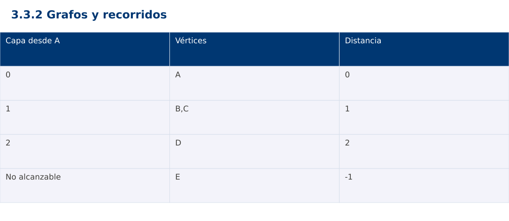

# Estructura de Datos
## 3.3.2 Grafos y recorridos · Java

**Ing. Pablo Torres, Mgtr.** · Universidad Politécnica Salesiana · Computación · Cuenca  
Unidad 3: Estructura de Datos y Grafos

[Índice del curso](../../../index.html) · [Presentación Java](../presentacion.pptx) · [Evaluación Moodle](../evaluaciones/tema.xml)

<a id="conceptos"></a>
## 1. Conceptos y ejemplos

**Prerrequisitos:** variables, condiciones, bucles, funciones y arreglos. Revisa las estructuras lineales antes de este contenido.

<a id="concepto-1"></a>
### 1.1 Vértices y aristas

Un grafo modela entidades y relaciones. Puede ser dirigido o no dirigido, ponderado o no ponderado. En esta demostración las aristas no tienen pesos y son no dirigidas: cada enlace se registra en ambas listas de vecinos. La cantidad de vértices es V y la de aristas E. Un vértice aislado también forma parte del grafo y no debe perderse por carecer de aristas.

<a id="concepto-2"></a>
### 1.2 Representación

La matriz de adyacencia reserva Θ(V²) posiciones y permite consultar una arista por índice. Una lista de adyacencia reserva Θ(V+E) y facilita enumerar vecinos, especialmente en grafos dispersos. En un grafo no dirigido cada arista aparece dos veces en las listas, lo cual no cambia el orden asintótico. El contrato debe decidir si permite autoaristas y múltiples aristas.

<a id="concepto-3"></a>
### 1.3 BFS y distancia mínima

BFS usa una cola y descubre vértices por capas. Se marca un vértice cuando se encola, evitando incorporarlo varias veces. La distancia del vecino nuevo es distancia(actual)+1. Al agotarse la cola se han visitado todos los alcanzables desde el origen. Estas distancias son mínimas en número de aristas para grafos sin pesos; la propiedad no se traslada a pesos arbitrarios.

<a id="concepto-4"></a>
### 1.4 DFS y componentes

DFS explora una rama antes de retroceder, usando recursión o una pila explícita. Resulta útil para componentes y análisis estructural. En un grafo con ciclos siempre hace falta registrar visitados. Un recorrido desde un solo origen no cubre componentes desconectadas. Para cubrir todo el grafo, se inicia otro recorrido en cada vértice aún no visitado.

### Pseudocódigo de DFS con control de visitados

```text
DFS(u):
    marcar u como visitado
    registrar u en el orden de exploración
    para cada vecino v de u:
        si v no está visitado:
            predecesor[v] = u
            DFS(v)
```

Este esquema mantiene un conjunto de visitados compartido por todo el recorrido. En el grafo de la demostración, con vecinos en el orden declarado, DFS desde A visita A,B,D,C; BFS visita A,B,C,D. E queda fuera de ambos recorridos porque es un vértice aislado. Los predecesores de DFS reconstruyen un camino válido, que no necesariamente es el más corto. El pseudocódigo complementa la demostración ejecutable de BFS y no resuelve la ampliación de la PC.

<a id="concepto-5"></a>
### 1.5 Costo y contratos

Con listas de adyacencia, BFS y DFS completos cuestan Θ(V+E), y sus estructuras de control Θ(V). Con matriz, revisar todos los posibles vecinos cuesta Θ(V²). La demostración ordena vecinos por la forma de construcción para producir una traza reproducible, valida el origen y representa con -1 la distancia de los inalcanzables. No se utiliza -1 para una distancia real.

<a id="traza"></a>
### Traza de referencia

| Capa desde A | Vértices | Distancia |
| --- | --- | --- |
| 0 | A | 0 |
| 1 | B,C | 1 |
| 2 | D | 2 |
| No alcanzable | E | -1 |

La tabla muestra estados o conteos concretos. Reproduce cada transición y comprueba qué propiedad permanece verdadera. Una traza finita ayuda a encontrar errores; la justificación del algoritmo también exige explicar por qué progresa y por qué la condición final satisface el contrato.



### Particularidades de Java

Java usa tipos estáticos y comprobación de tipos en compilación. int y long tienen rango fijo; los cálculos deben promoverse antes de una multiplicación que pudiera desbordar. Las referencias permiten compartir objetos y la copia de un arreglo de objetos es superficial. Las excepciones de los contratos se comprueban explícitamente. No se necesita Maven ni Gradle: el modo de archivo fuente ejecuta Demo.java con un JDK instalado.

<a id="demostracion"></a>
## 2. Demostración guiada

**Problema y contrato:** Grafo no dirigido sin pesos. Todas las referencias de vecinos existen como claves. Origen existente obligatorio. Retorna distancia mínima en aristas y -1 para inalcanzables. La cola JS usa índice de frente, sin shift.

1. Lee el contrato y predice la salida del caso principal antes de ejecutar.
2. Identifica las variables que representan el estado y vincúlalas con la traza de la sección anterior.
3. Ejecuta el archivo completo. Las comprobaciones internas detienen el programa si una condición esperada falla.
4. Cambia una entrada del bloque de ejecución, predice el resultado y contrástalo. Conserva el núcleo de la demostración como referencia.

### Código completo

Este bloque se genera desde `ejemplos/Demo.java` mediante `scripts/sync-code.py`; ese archivo es la fuente del código. La PC tiene otro objetivo y sus casos de aceptación aparecen en la sección 3.

<!-- DEMO:START -->
```java
import java.util.*;

public class Demo {
    static void check(boolean ok) {
        if (!ok) throw new AssertionError("Verificación fallida");
    }
static Map<String,Integer> bfs(Map<String,List<String>> graph,String start) {
        if (!graph.containsKey(start)) throw new IllegalArgumentException("origen");
        Map<String,Integer> distance=new LinkedHashMap<>();
        for (String vertex:graph.keySet()) distance.put(vertex,-1);
        Deque<String> queue=new ArrayDeque<>(); queue.addLast(start); distance.put(start,0);
        while (!queue.isEmpty()) {
            String u=queue.removeFirst();
            for (String v:graph.get(u)) if (distance.get(v)==-1) {
                distance.put(v,distance.get(u)+1); queue.addLast(v);
            }
        }
        return distance;
    }
    public static void main(String[] args) {
        Map<String,List<String>> g=new LinkedHashMap<>();
        g.put("A",Arrays.asList("B","C")); g.put("B",Arrays.asList("A","D"));
        g.put("C",Arrays.asList("A","D")); g.put("D",Arrays.asList("B","C"));
        g.put("E",Collections.emptyList());
        Map<String,Integer> d=bfs(g,"A"); check(d.get("D")==2 && d.get("E")==-1);
        for (String key:d.keySet()) System.out.println(key+":"+d.get(key));
        try { bfs(g,"X"); throw new AssertionError(); }
        catch (IllegalArgumentException expected) { }
    }
}
```
<!-- DEMO:END -->

### Ejecución

Desde esta carpeta `03-data-structures/3.3.2-graphs/java`:

```bash
java ejemplos/Demo.java
```

### Salida esperada de la demostración

```text
A:0
B:1
C:1
D:2
E:-1
```

La salida procede de los datos fijos del bloque de ejecución. Las verificaciones internas también cubren los casos adicionales que se leen en el código. El registro de ejecuciones realizadas se conserva en [verificación](../../../docs/verificacion.md), separado de estas expectativas.

<a id="pc"></a>
## 3. PC — 3.3.2: Grafos y recorridos

Implementa reconstrucción de un camino mínimo sin pesos mediante un mapa de predecesores de BFS. Añade detección de componentes conexas. Documenta cómo resuelves empates entre caminos del mismo largo.

### Requisitos de la entrega

- Implementa la actividad en **una versión**, a tu elección entre Java, Python y JavaScript. Las PL se entregan exclusivamente en Java.
- Separa la lógica del procesamiento de la entrada y la impresión. Documenta tipos, dominio válido, salida y comportamiento de error.
- Conserva los casos de aceptación siguientes y agrega al menos un caso que compruebe el invariante del tema.
- No copies como solución el bloque de demostración: resuelve la ampliación pedida. No se suministra una solución completa de esta PC.

### Casos de aceptación de la PC

| Entrada o escenario | Resultado exigido |
| --- | --- |
| A-B, A-C, B-D, C-D; A a D | camino de longitud 2 |
| E aislado; A a E | sin camino |
| A a A | [A], longitud 0 |

### Ejecución y evidencia

Desde la carpeta de tu entrega, ejecuta el programa con `java Main.java`. Si divides Java en paquetes, utiliza los comandos de la plantilla del estudiante. Registra entrada, resultado esperado, resultado real y explicación de cualquier diferencia en `evidencias/PC3.3.2.md` de tu repositorio personal.

Crea commits pequeños: `feat(pc3.3.2): implementar contrato`, `test(pc3.3.2): cubrir casos limite` y `docs(pc3.3.2): explicar costos`. Sustituye los mensajes por descripciones del cambio real. Obtén el hash con `git rev-parse HEAD` y revisa una etapa con `git show HASH`. La actividad no necesita continuar un proyecto acumulativo.


<a id="esencial"></a>
## Lo esencial

- Un grafo modela entidades y relaciones.
- Con listas de adyacencia, BFS y DFS completos cuestan Θ(V+E), y sus estructuras de control Θ(V).
- Explica el contrato, traza una entrada y justifica tiempo y memoria con las condiciones descritas.

## Referencias

- Programa analítico y referencias del docente: correspondencia en el documento docente de este contenido.
- [Referencia técnica de Java](https://docs.oracle.com/en/java/javase/27/docs/api/).
- [Bibliografía y análisis de fuentes](../../../docs/analisis-referencias.md).
