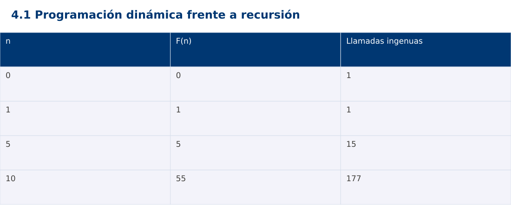

# Estructura de Datos
## 4.1 Programación dinámica frente a recursión · Java

**Ing. Pablo Torres, Mgtr.** · Universidad Politécnica Salesiana · Computación · Cuenca  
Unidad 4: Programación Dinámica

[Índice del curso](../../../index.html) · [Presentación Java](../presentacion.pptx) · [Evaluación Moodle](../evaluaciones/tema.xml)

<a id="conceptos"></a>
## 1. Conceptos y ejemplos

**Prerrequisitos:** variables, condiciones, bucles, funciones y arreglos. Revisa las estructuras lineales antes de este contenido.

<a id="concepto-1"></a>
### 1.1 Estados y subproblemas

Programación dinámica resuelve estados y reutiliza sus resultados. No toda recursión necesita programación dinámica: debe existir trabajo repetido que merezca guardarse. Para Fibonacci, el estado es n y F(n)=F(n-1)+F(n-2), con F(0)=0 y F(1)=1. En problemas de optimización también se justifica la subestructura óptima: una solución óptima se compone de decisiones y soluciones óptimas de subproblemas apropiados.

<a id="concepto-2"></a>
### 1.2 Recursión ingenua

La solución directa expresa bien la recurrencia pero recalcula F(3), F(2) y otros estados muchas veces. El árbol de llamadas crece exponencialmente, mientras la profundidad crece linealmente. La demostración usa n pequeño y rechaza n>30 para evitar trabajo desproporcionado. El límite es una decisión didáctica del contrato, no una propiedad matemática de Fibonacci.

<a id="concepto-3"></a>
### 1.3 Tabulación y orden de dependencias

La tabulación llena una tabla desde los casos base hacia estados mayores. Cuando calcula dp[i], dp[i-1] y dp[i-2] ya existen. El invariante afirma que la tabla hasta i contiene resultados correctos. Se calculan n+1 estados y el tiempo es Θ(n) bajo el modelo aritmético del ejemplo. La tabla completa ocupa Θ(n), aunque Fibonacci puede reducir memoria a dos valores previos.

<a id="concepto-4"></a>
### 1.4 Optimización de espacio y reconstrucción

Si solo se necesita F(n), se conservan los dos resultados anteriores en Θ(1) posiciones. Si el problema exige reconstruir decisiones, descartar estados puede impedir explicar cómo se obtuvo la solución. Primero define qué salida hace falta. Las mejoras de memoria deben derivarse de dependencias, no aplicarse mecánicamente a cualquier tabla.

<a id="concepto-5"></a>
### 1.5 Comparación justa

Compara la misma definición, el mismo dominio y la misma salida. Cuenta llamadas recursivas y estados calculados aparte de medir tiempo. No uses un cache caliente en una versión y uno vacío en otra sin declararlo. Para n=10, Fibonacci devuelve 55 y la versión ingenua realiza 177 llamadas con la implementación de dos casos base. La versión tabulada calcula cada estado una vez.

<a id="traza"></a>
### Traza de referencia

| n | F(n) | Llamadas ingenuas |
| --- | --- | --- |
| 0 | 0 | 1 |
| 1 | 1 | 1 |
| 5 | 5 | 15 |
| 10 | 55 | 177 |

La tabla muestra estados o conteos concretos. Reproduce cada transición y comprueba qué propiedad permanece verdadera. Una traza finita ayuda a encontrar errores; la justificación del algoritmo también exige explicar por qué progresa y por qué la condición final satisface el contrato.



### Particularidades de Java

Java usa tipos estáticos y comprobación de tipos en compilación. int y long tienen rango fijo; los cálculos deben promoverse antes de una multiplicación que pudiera desbordar. Las referencias permiten compartir objetos y la copia de un arreglo de objetos es superficial. Las excepciones de los contratos se comprueban explícitamente. No se necesita Maven ni Gradle: el modo de archivo fuente ejecuta Demo.java con un JDK instalado.

<a id="demostracion"></a>
## 2. Demostración guiada

**Problema y contrato:** El programa valida n entero en [0,30] antes de invocar los núcleos recursive y tabulated. Estos núcleos presuponen entrada validada. Imprime n:resultado:llamadas de la versión ingenua.

1. Lee el contrato y predice la salida del caso principal antes de ejecutar.
2. Identifica las variables que representan el estado y vincúlalas con la traza de la sección anterior.
3. Ejecuta el archivo completo. Las comprobaciones internas detienen el programa si una condición esperada falla.
4. Cambia una entrada del bloque de ejecución, predice el resultado y contrástalo. Conserva el núcleo de la demostración como referencia.

### Código completo

Este bloque se genera desde `ejemplos/Demo.java` mediante `scripts/sync-code.py`; ese archivo es la fuente del código. La PC tiene otro objetivo y sus casos de aceptación aparecen en la sección 3.

<!-- DEMO:START -->
```java
import java.util.*;

public class Demo {
    static void check(boolean ok) {
        if (!ok) throw new AssertionError("Verificación fallida");
    }
static long calls;
    static long recursive(int n) { calls++; return n<2?n:recursive(n-1)+recursive(n-2); }
    static long tabulated(int n) {
        long[] dp=new long[n+2]; dp[1]=1;
        for (int i=2;i<=n;i++) dp[i]=dp[i-1]+dp[i-2];
        return dp[n];
    }
    static void validate(int n) {
        if (n<0 || n>30) throw new IllegalArgumentException("n fuera de rango");
    }
    public static void main(String[] args) {
        for (int n:new int[]{0,1,5,10}) {
            validate(n); calls=0; long value=recursive(n); check(value==tabulated(n));
            System.out.println(n+":"+value+":"+calls);
        }
        try { validate(-1); throw new AssertionError(); }
        catch (IllegalArgumentException expected) { }
    }
}
```
<!-- DEMO:END -->

### Ejecución

Desde esta carpeta `04-dynamic-programming/4.1-dynamic-programming/java`:

```bash
java ejemplos/Demo.java
```

### Salida esperada de la demostración

```text
0:0:1
1:1:1
5:5:15
10:55:177
```

La salida procede de los datos fijos del bloque de ejecución. Las verificaciones internas también cubren los casos adicionales que se leen en el código. El registro de ejecuciones realizadas se conserva en [verificación](../../../docs/verificacion.md), separado de estas expectativas.

<a id="pc"></a>
## 3. PC — 4.1: Programación dinámica frente a recursión

Resuelve el número de formas de subir n escalones con pasos de 1 o 2. Define formas(0)=1. Implementa recursión directa y tabulación, cuenta trabajo y explica la relación entre el estado y sus dependencias.

### Requisitos de la entrega

- Implementa la actividad en **una versión**, a tu elección entre Java, Python y JavaScript. Las PL se entregan exclusivamente en Java.
- Separa la lógica del procesamiento de la entrada y la impresión. Documenta tipos, dominio válido, salida y comportamiento de error.
- Conserva los casos de aceptación siguientes y agrega al menos un caso que compruebe el invariante del tema.
- No copies como solución el bloque de demostración: resuelve la ampliación pedida. No se suministra una solución completa de esta PC.

### Casos de aceptación de la PC

| Entrada o escenario | Resultado exigido |
| --- | --- |
| n=0 | 1 forma |
| n=4 | 5 formas |
| n=6 | 13 formas |
| n negativo | rechazo explícito |

### Ejecución y evidencia

Desde la carpeta de tu entrega, ejecuta el programa con `java Main.java`. Si divides Java en paquetes, utiliza los comandos de la plantilla del estudiante. Registra entrada, resultado esperado, resultado real y explicación de cualquier diferencia en `evidencias/PC4.1.md` de tu repositorio personal.

Crea commits pequeños: `feat(pc4.1): implementar contrato`, `test(pc4.1): cubrir casos limite` y `docs(pc4.1): explicar costos`. Sustituye los mensajes por descripciones del cambio real. Obtén el hash con `git rev-parse HEAD` y revisa una etapa con `git show HASH`. La actividad no necesita continuar un proyecto acumulativo.


<a id="esencial"></a>
## Lo esencial

- Programación dinámica resuelve estados y reutiliza sus resultados.
- Compara la misma definición, el mismo dominio y la misma salida.
- Explica el contrato, traza una entrada y justifica tiempo y memoria con las condiciones descritas.

## Referencias

- Programa analítico y referencias del docente: correspondencia en el documento docente de este contenido.
- [Referencia técnica de Java](https://docs.oracle.com/en/java/javase/27/docs/api/).
- [Bibliografía y análisis de fuentes](../../../docs/analisis-referencias.md).
