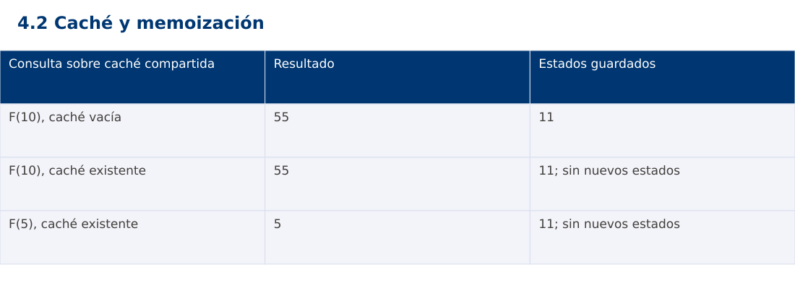

# Estructura de Datos
## 4.2 Caché y memoización · JavaScript

**Ing. Pablo Torres, Mgtr.** · Universidad Politécnica Salesiana · Computación · Cuenca  
Unidad 4: Programación Dinámica

[Índice del curso](../../../index.html) · [Presentación Java](../presentacion.pptx) · [Evaluación Moodle](../evaluaciones/tema.xml)

<a id="conceptos"></a>
## 1. Conceptos y ejemplos

**Prerrequisitos:** variables, condiciones, bucles, funciones y arreglos. Revisa las estructuras lineales antes de este contenido.

<a id="concepto-1"></a>
### 1.1 Caché como reutilización

Una caché guarda resultados para consultas posteriores. Un acierto reutiliza un valor y un fallo obliga a calcularlo. Deben definirse clave, vigencia y política de eliminación. Si cambia la entrada original pero la clave no refleja ese cambio, la caché puede devolver una respuesta obsoleta. El ejemplo usa una función pura de n, por lo que el mismo n conserva el mismo resultado.

<a id="concepto-2"></a>
### 1.2 Memoización de arriba hacia abajo

La memoización mantiene la formulación recursiva. Antes de resolver un estado se consulta el diccionario; si falta, se calcula, guarda y retorna. El mapa debe compartirse entre llamadas del mismo problema. Crear un mapa vacío en cada llamada impide reutilizar. El costo es número de estados distintos por trabajo de cada transición, bajo acceso esperado constante al mapa.

<a id="concepto-3"></a>
### 1.3 Estado completo y límites

Si una función depende de posición y capacidad, la clave necesita ambos componentes. Usar solo posición mezcla problemas diferentes y produce errores silenciosos. El valor cero puede ser una respuesta válida y no debe interpretarse automáticamente como ausencia. Las estructuras contienen solo estados de la instancia actual o incorporan identidad de la instancia en la clave.

<a id="concepto-4"></a>
### 1.4 Memoria, vida útil e invalidación

La memoización de Fibonacci reserva Θ(n) valores y Θ(n) profundidad de pila. Para entradas profundas conviene tabulación. En aplicaciones con datos cambiantes, una caché puede usar caducidad temporal o invalidación por modificación. Limitar capacidad exige decidir qué entrada se expulsa, como LRU. Aquí se mantiene una caché por ejecución y se miden consultas frías y repetidas de forma separada.

<a id="concepto-5"></a>
### 1.5 Proyecto final

El laboratorio final aplica programación dinámica a selección de actividades con presupuesto entero: estado (i,capacidad), decisiones incluir o excluir y reconstrucción de la elección. Se contrasta una versión recursiva pequeña con memoización y tabulación. El problema es independiente de los laboratorios previos y aprovecha sus herramientas de análisis sin exigir un proyecto acumulativo.

<a id="traza"></a>
### Traza de referencia

| Consulta sobre caché compartida | Resultado | Estados guardados |
| --- | --- | --- |
| F(10), caché vacía | 55 | 11 |
| F(10), caché existente | 55 | 11; sin nuevos estados |
| F(5), caché existente | 5 | 11; sin nuevos estados |

La tabla muestra estados o conteos concretos. Reproduce cada transición y comprueba qué propiedad permanece verdadera. Una traza finita ayuda a encontrar errores; la justificación del algoritmo también exige explicar por qué progresa y por qué la condición final satisface el contrato.



### Particularidades de JavaScript

JavaScript se ejecuta aquí con Node.js como módulo .mjs. Number solo representa exactamente enteros hasta 2^53-1; factorial usa BigInt y no mezcla su aritmética con Number. Math.floor realiza la división para índices. [...a] es una copia superficial. Map y Set expresan asociaciones y pertenencia. Los errores se verifican con condiciones explícitas, ya que console.assert no sustituye una prueba que detenga el proceso. No se requiere pnpm.

<a id="demostracion"></a>
## 2. Demostración guiada

**Problema y contrato:** n entero en [0,30]. Caché mutable inicialmente vacía o con valores correctos de esta misma función. El cliente no debe introducir resultados falsos. Imprime n:resultado:cantidad de estados guardados.

1. Lee el contrato y predice la salida del caso principal antes de ejecutar.
2. Identifica las variables que representan el estado y vincúlalas con la traza de la sección anterior.
3. Ejecuta el archivo completo. Las comprobaciones internas detienen el programa si una condición esperada falla.
4. Cambia una entrada del bloque de ejecución, predice el resultado y contrástalo. Conserva el núcleo de la demostración como referencia.

### Código completo

Este bloque se genera desde `ejemplos/demo.mjs` mediante `scripts/sync-code.py`; ese archivo es la fuente del código. La PC tiene otro objetivo y sus casos de aceptación aparecen en la sección 3.

<!-- DEMO:START -->
```javascript
function fibonacci(n,cache) {
    if (!Number.isInteger(n) || n<0 || n>30) throw new RangeError('n fuera de rango');
    function memo(k) {
        if (cache.has(k)) return cache.get(k);
        const value=k<2?k:memo(k-1)+memo(k-2);
        cache.set(k,value); return value;
    }
    return memo(n);
}
const cache=new Map();
for (const n of [10,10,5]) {
    const value=fibonacci(n,cache);
    if (value!==(n===5?5:55)) throw new Error('Fibonacci');
    console.log(`${n}:${value}:${cache.size}`);
}
if (fibonacci(0,new Map())!==0) throw new Error('Cero válido');
let rejected=false;
try { fibonacci(-1,cache); } catch (e) { rejected=e instanceof RangeError; }
if (!rejected) throw new Error('Dominio');
```
<!-- DEMO:END -->

### Ejecución

Desde esta carpeta `04-dynamic-programming/4.2-memoization/js`:

```bash
node ejemplos/demo.mjs
```

### Salida esperada de la demostración

```text
10:55:11
10:55:11
5:5:11
```

La salida procede de los datos fijos del bloque de ejecución. Las verificaciones internas también cubren los casos adicionales que se leen en el código. El registro de ejecuciones realizadas se conserva en [verificación](../../../docs/verificacion.md), separado de estas expectativas.

<a id="pc"></a>
## 3. PC — 4.2: Caché y memoización

Implementa costo mínimo para alcanzar un monto con monedas positivas y reutilizables. Usa una clave por monto y guarda también estados imposibles. Compara memoización con tabulación y define una respuesta explícita cuando no existe solución.

### Requisitos de la entrega

- Implementa la actividad en **una versión**, a tu elección entre Java, Python y JavaScript. Las PL se entregan exclusivamente en Java.
- Separa la lógica del procesamiento de la entrada y la impresión. Documenta tipos, dominio válido, salida y comportamiento de error.
- Conserva los casos de aceptación siguientes y agrega al menos un caso que compruebe el invariante del tema.
- No copies como solución el bloque de demostración: resuelve la ampliación pedida. No se suministra una solución completa de esta PC.

### Casos de aceptación de la PC

| Entrada o escenario | Resultado exigido |
| --- | --- |
| monedas [1,3,4], monto 6 | 2 monedas |
| monedas [2], monto 3 | -1: imposible |
| monto 0 | 0 monedas |
| moneda 0 o negativa | entrada inválida |

### Ejecución y evidencia

Desde la carpeta de tu entrega, ejecuta el programa con `node main.mjs`. Si divides Java en paquetes, utiliza los comandos de la plantilla del estudiante. Registra entrada, resultado esperado, resultado real y explicación de cualquier diferencia en `evidencias/PC4.2.md` de tu repositorio personal.

Crea commits pequeños: `feat(pc4.2): implementar contrato`, `test(pc4.2): cubrir casos limite` y `docs(pc4.2): explicar costos`. Sustituye los mensajes por descripciones del cambio real. Obtén el hash con `git rev-parse HEAD` y revisa una etapa con `git show HASH`. La actividad no necesita continuar un proyecto acumulativo.


<a id="esencial"></a>
## Lo esencial

- Una caché guarda resultados para consultas posteriores.
- El laboratorio final aplica programación dinámica a selección de actividades con presupuesto entero: estado (i,capacidad), decisiones incluir o excluir y reconstrucción de la elección.
- Explica el contrato, traza una entrada y justifica tiempo y memoria con las condiciones descritas.

## Referencias

- Programa analítico y referencias del docente: correspondencia en el documento docente de este contenido.
- [Referencia técnica de JavaScript](https://developer.mozilla.org/en-US/docs/Web/JavaScript/Reference).
- [Bibliografía y análisis de fuentes](../../../docs/analisis-referencias.md).
